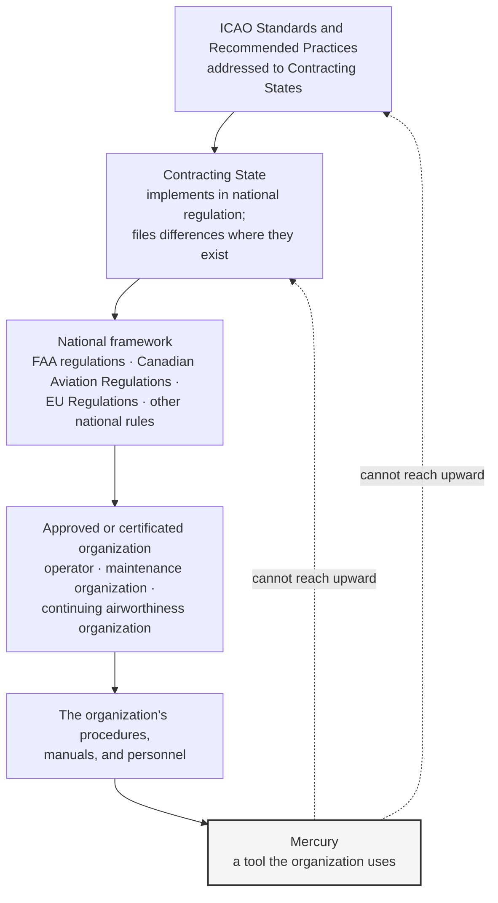
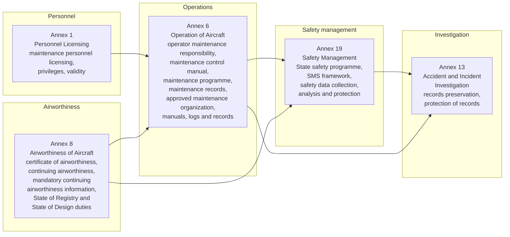
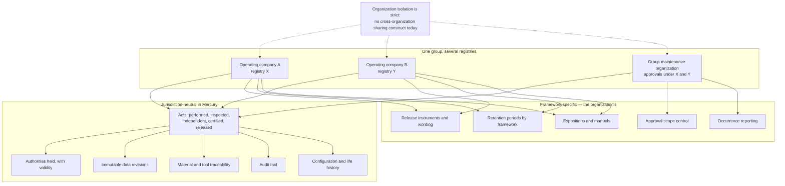
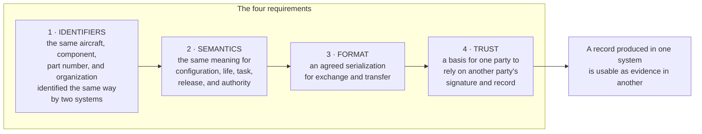

# ICAO — Orientation to International Standards and Mercury's Interoperability Position

| Field | Value |
|-------|-------|
| Document | ICAO orientation — Annex 6, Annex 8, and Annex 19 concepts; safety data principles; global interoperability of the digital thread |
| Product | Mercury Aviation Enterprise Operating System (AEOS) |
| Organization | Mercury Technologies |
| Layer | Regulations — descriptive orientation and interoperability position |
| Audience | Enterprise architects, safety managers, quality functions in multi-jurisdiction groups, lessors and asset managers, integration architects, domain consultants |
| Status | Living baseline |
| Posture | **Descriptive and advisory. ICAO does not certify, approve, or endorse products or organizations, and Mercury holds no ICAO standing of any kind.** |
| Companion documents | [FAA](FAA.md) · [Transport Canada](Transport_Canada.md) · [EASA](EASA.md) |
| Upstream authority | [Authority domain](../03_Business/Authority.md) · [SECURITY.md](../../SECURITY.md) · [Blueprint README](../../README.md) |

---

## 1. Scope

### 1.1 In scope

This document orients a Mercury reader to the **international layer** of aviation regulation — the ICAO Standards and Recommended Practices that States implement in their national frameworks — and states Mercury's position on the two things that layer implies for a platform:

1. **Why the national frameworks resemble each other**, and why one evidence model can therefore serve an operator with fleets on several registries.
2. **What global interoperability of a digital thread actually requires**, and which of those requirements Mercury meets, partly meets, or does not meet today.

| Reader | What they get from this document |
|--------|----------------------------------|
| A **multi-jurisdiction group** — an operator, MRO group, or lessor with assets across registries | An explanation of which parts of Mercury's evidence model are jurisdiction-neutral by design and which parts require framework-specific handling by the organization |
| A **Mercury architect** | The conceptual ancestry of the record, certification, and safety-data concepts that the FAA, Transport Canada, and EASA documents map in detail, plus the interoperability standards that a future exchange capability would have to respect |
| A **safety function** | An honest statement of Mercury's relationship to safety management and safety data principles: a data source and evidence spine, not a safety management system |

### 1.2 Out of scope

| Concern | Authoritative location |
|---------|------------------------|
| National framework detail | [FAA](FAA.md) · [Transport Canada](Transport_Canada.md) · [EASA](EASA.md) |
| Mercury's regulatory standing and non-claims | [Authority §1.3](../03_Business/Authority.md#13-what-mercury-does-not-claim) · [SECURITY.md §8](../../SECURITY.md#8-what-mercury-does-not-claim) |
| Audit record structure, fail-closed policy, retention behaviour | [Audit](../06_Security/Audit.md) |
| Signature construction and cryptographic limits | [Digital Signatures](../06_Security/Digital_Signatures.md) |
| Thread nodes, edges, traversals, and the Digital Aircraft Passport | [Digital Thread](../04_Data/Digital_Thread.md) |
| State safety programmes, State oversight systems, and audit of States | Entirely outside Mercury's scope. Mercury is a tool used by organizations, not by States |
| **Legal interpretation of any Annex, PANS, or guidance document** | Not provided anywhere in this repository. See §11 |

### 1.3 Honesty markers

| Marker | Meaning |
|--------|---------|
| **Implemented** | Present in the runtime today |
| **Partial** | Present for a subset of the described concept |
| **Planned** | Designed in the blueprint, not built |
| **Not modelled** | Absent, and not currently on a horizon |

There is deliberately **no marker meaning "compliant."** At the ICAO layer that would be doubly meaningless: ICAO Standards address **States**, not software.

### 1.4 The most important structural fact in this document

**ICAO Standards and Recommended Practices are addressed to Contracting States, not to organizations and certainly not to vendors.**

A State implements the Standards in its national regulations. Organizations comply with those national regulations. Software supports organizations. There are three layers between an ICAO Standard and a Mercury feature, and every one of them belongs to somebody other than Mercury.

The dotted edges are the point. **No capability Mercury builds can create standing at the State or ICAO layer.** What a platform can do is make an organization's evidence resolvable, which helps the organization, which helps the State's oversight of that organization, which is as far up the chain as software reaches.

---

## 2. Purpose

### 2.1 Why an ICAO document exists in this set at all

Three reasons, and none of them is a compliance claim.

| Reason | What it delivers |
|--------|------------------|
| **It explains the family resemblance** | A reader who has absorbed the FAA, Transport Canada, and EASA documents will notice that the same concepts recur: a maintenance record with attribution, a release act by an authorized person, a programme of scheduled maintenance, mandatory continuing airworthiness information, a safety management framework. That recurrence is not coincidence — it is the ICAO layer showing through. Understanding it is what lets an architect build **one** evidence model instead of three |
| **It frames the multi-jurisdiction case honestly** | Groups with assets on several registries need to know which parts of the platform are jurisdiction-neutral and which are not. §7 answers that directly, including where Mercury falls short |
| **It sets the bar for interoperability** | "Global digital thread" is easy to say. §8 states what it would actually require — identifier standards, data exchange standards, records transfer standards, a trust framework for signatures — and marks Mercury's position against each |

### 2.2 The design position underneath the orientation

Mercury's evidence posture, stated in full in [Authority §1.1](../03_Business/Authority.md#11-what-this-domain-exists-to-do): **evidence is a by-product of doing the work correctly, not an artefact assembled afterwards.**

At the international layer this posture has a specific and useful consequence: **an evidence record that captures who acted, under what authority, at what moment, against which immutable data, is meaningful in any framework**, because every framework asks those four questions. What differs between frameworks is the *instrument* — a Form 337, a maintenance release, a CRS, a Form 1 — and the conditions attached to it. Mercury records the act, not the instrument. That is why the model travels, and it is also precisely why Mercury cannot produce any framework's instrument. The strength and the limitation are the same design decision.

---

## 3. What Mercury is not

| Mercury does **not** hold, claim, or imply | The accurate position |
|--------------------------------------------|-----------------------|
| **Any ICAO certification, approval, endorsement, registration, or recognition** | ICAO does not certify, approve, endorse, or register products, software, or commercial organizations. There is no such thing to hold, and any vendor claiming it is describing something that does not exist |
| **Compliance with, or conformity to, an ICAO Annex** | Annexes address Contracting States. A software platform cannot comply with a Standard addressed to a State, and Mercury does not claim to |
| That Mercury helps a **State** discharge its obligations | Mercury is used by organizations. It has no State-facing capability, no oversight-system integration, and no role in a State safety programme or a State's oversight system |
| That Mercury is **audited, assessed, or recognized** under any ICAO programme | Universal safety oversight auditing assesses **States**. Mercury is not within its scope in any sense |
| That Mercury implements a **safety management system** | Mercury is a source of maintenance safety data and an audit-evidence spine. See §6 |
| That Mercury provides a **safety data collection and processing system** in the Annex 19 sense | It holds maintenance and airworthiness data that such a system could consume. It is not one, and it does not implement the protections such a system requires. See §6.3 |
| That Mercury satisfies **journey log, technical log, or flight record** obligations | It does not implement any of them. See §5.2 |
| That Mercury implements a **standard aviation data exchange format** | No ICAO, ATA, or industry exchange standard is implemented today. See §8 |
| That Mercury's records are **portable between platforms** by standard | Records are exportable by API today; there is no standards-based records-transfer capability. See §8.3 |
| That Mercury's signatures participate in an **industry trust framework** | They do not. Signatures are hash-attested, not certificate-backed, and no trust anchor, certificate policy, or cross-certification exists. See [Digital Signatures §8](../06_Security/Digital_Signatures.md#8-what-this-is-not--the-cryptographic-limit) |
| That Mercury is approved for **military, defence, or safety-of-life** use | Not claimed. See [ROADMAP §8](../../ROADMAP.md#8-explicit-non-goals) |

**Why the first row is stated first.** "ICAO compliant" is the single most common false claim in aviation software marketing, because it sounds authoritative and is almost never challenged. It is meaningless. Mercury will not make it, and any Mercury material that does is wrong and should be corrected against this document.

---

## 4. Regulatory context overview

### 4.1 The Annexes that matter to a maintenance and airworthiness platform

| Annex | Subject | Why it matters to Mercury |
|-------|---------|---------------------------|
| **Annex 1 — Personnel Licensing** | Licensing of maintenance personnel, the privileges attached to a licence, and validity | The conceptual ancestor of "a named, qualified person signs" — the property Mercury's signature model is built around |
| **Annex 6 — Operation of Aircraft** | The operator's maintenance responsibility, the maintenance control manual, the maintenance programme, maintenance records, continuing airworthiness information, modifications and repairs, the approved maintenance organization, and the manuals, logs, and records an aircraft carries | The densest source of concepts Mercury's planning, execution, and evidence domains serve |
| **Annex 8 — Airworthiness of Aircraft** | Certificates of airworthiness, continuing airworthiness of aircraft, the responsibilities of the State of Registry and the State of Design, and mandatory continuing airworthiness information | The origin of the mandatory-action concept that becomes an airworthiness directive nationally, and of the design-data baseline that maintenance instructions resolve to |
| **Annex 19 — Safety Management** | State safety programmes, the SMS framework for service providers, safety data and safety information collection, analysis, protection, and exchange | The source of the SMS and safety-data concepts in §6 |
| **Annex 13 — Accident and Incident Investigation** | Investigation, and the preservation and protection of records relevant to an occurrence | The reason append-only evidence and a complete audit trail matter beyond routine oversight. See §6.4 |

### 4.2 Annex 6 concepts, and where they reappear nationally

This table is the family-resemblance argument made concrete. It is the reason Mercury's evidence model can serve an operator whose fleet spans registries.

| Annex 6 concept | Appears in the FAA framework as | Appears in the Canadian framework as | Appears in the European framework as |
|-----------------|--------------------------------|--------------------------------------|--------------------------------------|
| The operator is responsible for the continuing airworthiness of its aircraft | Owner and operator responsibility, and air carrier airworthiness responsibility | The owner's and air operator's continuing airworthiness obligations | Continuing airworthiness responsibility under Part-M, managed by a CAMO where applicable |
| A maintenance programme approved by the State | Continuous airworthiness maintenance programme, or an inspection programme | The approved maintenance schedule | The aircraft maintenance programme |
| A maintenance control manual describing the operator's system | The operator's manual requirements and maintenance programme documentation | The maintenance control manual | The CAME, and the MOE on the maintenance side |
| Maintenance records with prescribed content and retention | Part 43 and Part 121 or 135 maintenance recording requirements | Technical records, including the aircraft technical record | The aircraft continuing airworthiness record system |
| A release or certification following maintenance | Approval for return to service, and the airworthiness release | The maintenance release | The certificate of release to service |
| An approved maintenance organization | The Part 145 repair station | The approved maintenance organization | The Part-145 organisation |
| Mandatory continuing airworthiness information from the State of Design | Airworthiness directives | Airworthiness directives | Airworthiness directives issued or adopted by the Agency |
| A journey log or equivalent operational record | Aircraft records and flight logs as required | The journey log | The operator's technical log system |
| Quality or reliability surveillance of the maintenance programme | Continuing analysis and surveillance | The quality assurance and evaluation programmes | Compliance monitoring within the management system |

**Read the last three rows carefully**, because they are where Mercury's coverage is uneven: mandatory continuing airworthiness information is well covered, the journey log and technical log are **not modelled at all**, and the surveillance and quality loop is **Partial** pending finding and audit programme management. Those gaps are stated identically in all three national documents, which is how a reader can tell they are real rather than diplomatic.

### 4.3 Annex 8 and the design-data baseline

The single most under-appreciated dependency in a maintenance records platform is that **maintenance instructions have an origin**, and its integrity determines whether a maintenance record means anything.

| Annex 8 concept | Mercury's dependency on it |
|-----------------|----------------------------|
| The State of Design's continuing responsibility for the type design and for issuing mandatory continuing airworthiness information | Mercury's AD and service bulletin registers are downstream of this. Mercury records obligations and their discharge; it does not originate them |
| Instructions for continued airworthiness produced by the design approval holder | The publication library's content is this data. Mercury's immutable revision model exists so that a maintenance record resolves to the exact instruction revision that governed the work |
| The certificate of airworthiness and its continuing validity | Mercury records the evidence that supports continued validity. It does not issue, hold, suspend, or reinstate any certificate |
| Modifications and repairs approved under the framework | Engineering order records reference the approved data. **The approval is not Mercury's, and Mercury does not evaluate approval status** |
| Transfer of registry, and the arrangements that accompany it | Mercury's records survive a re-registration because aircraft identity is the airframe serial, with registration history kept as an interval-bounded record. See [Digital Thread §7.2](../04_Data/Digital_Thread.md#72-the-four-faces) — identity survives a re-registration by construction |

That last row is worth dwelling on. Aircraft change registration marks, operators, and registries across their lives, and a platform that treats the registration mark as the aircraft's identity loses history at every transition. Mercury does not, and that design choice is what makes a fifteen-year evidence chain hold together across an asset's commercial life.

---

## 5. Mercury capability mapping — Annex 6 and Annex 8 concepts

### 5.1 How to read the tables in this section

| Column | Meaning |
|--------|---------|
| **International concept** | The concept as it appears at the ICAO layer, in that layer's vocabulary |
| **Mercury capability** | The platform capability producing data of that kind, with its capability identifier where one exists |
| **Standing** | Implemented, Partial, Planned, or Not modelled — per §1.3 |
| **Remains the organization's responsibility** | What Mercury does **not** do |

A reminder that applies to every row: these are **concepts**, reached through a State's national implementation. A populated row does not mean an ICAO Standard is met, because an ICAO Standard is not something an organization or a platform meets — it is something a State implements.

### 5.2 Operator maintenance responsibility, programme, and records

| International concept | Mercury capability | Standing | Remains the organization's responsibility |
|-----------------------|--------------------|----------|-------------------------------------------|
| The operator maintains its aircraft in an airworthy condition | Fleet registry, status, programme, forecast, deferral control, obligation registers | Implemented as the operating substrate | The responsibility, and every determination made under it |
| A maintenance programme containing the tasks and intervals, approved by the State | Maintenance programme with task library, intervals, thresholds, and **immutable approved revisions** | Implemented as a record of the programme | Authoring the programme, obtaining approval, and operating to the approved revision |
| The programme kept current, with revision control | Immutable programme revisions; historical work resolves to the revision that governed it (AUTH-C7) | Implemented | Submitting revisions and obtaining approval |
| A maintenance control manual describing the operator's maintenance system | Publication library with immutable revisions and controlled distribution | Implemented **as a library capability.** Mercury does not author or own the manual | Authoring, revising, obtaining approval, and ensuring personnel use the current revision |
| Maintenance records: what was done, when, by whom, and against what data | Technical logbook (AUTH-C4), certification events (AUTH-C2), signatures (AUTH-C3), task records, and enforced publication revision binding (MRO-C10) | Implemented | Whether the record set satisfies the applicable national requirement, and the accuracy of its content |
| Record of total time in service and the status of life-limited items | Aircraft utilization counters; component life with TSN, CSN, TSO, CSO and applicable limits | Implemented — **current counters only; no utilization history table**, and **no life reconciliation job** | Accuracy of reported utilization, and reconciliation after a discrepancy |
| Record of compliance with mandatory continuing airworthiness information | AD register with per-revision compliance position and linked work orders | Implemented — **structured compliance state is Partial**; see [Authority §3.1](../03_Business/Authority.md#31-entity-register) | Applicability determination, method-of-compliance selection, and the compliance decision |
| Record of modifications and repairs | Engineering order records with approval workflow, linked tasks, and affected components | Implemented — **no dedicated modification record** | Approval of the data, and its acceptability |
| Retention of maintenance records for the prescribed period | Durable append-only evidence with configurable retention | **Partial** — retention is a **query filter**, not a deletion lifecycle. See [Audit §7.2](../06_Security/Audit.md#72-the-retention-window-is-a-query-filter) | Archival, deletion where required, and satisfying the actual retention period |
| Transfer of records when the aircraft changes operator or owner | Digital Aircraft Passport as a traversal; **one-command evidence pack export is Planned** (AUTH-C14). See [Digital Thread §7.4](../04_Data/Digital_Thread.md#74-implementation-status--stated-plainly) | **Partial** | Executing the transfer and satisfying the receiving party and the State |
| **A journey log book, and the records an aircraft carries** | **Not modelled.** Mercury's technical logbook is a maintenance release record, not an operational journey record, and Mercury implements no carried-record capability | **Not modelled** | The journey log and every carried record in full |
| Continuing airworthiness information fed back to the design approval holder | Fault codes, incident records, component removal history, and reliability data exist as sources; **no reporting channel is implemented** | **Partial** | Determining reportability, preparing reports, and submitting them |
| An approved maintenance organization performing the maintenance, or the operator's own approved capability | Multi-organization tenancy with isolation; **no cross-organization sharing construct**. See [Digital Thread §7.3](../04_Data/Digital_Thread.md#73-who-consumes-the-passport-and-for-what) | **Partial** | Holding the approval, contracting, and oversight of contracted maintenance |

### 5.3 Certification, release, and the person who signs

| International concept | Mercury capability | Standing | Remains the organization's responsibility |
|-----------------------|--------------------|----------|-------------------------------------------|
| Maintenance certified by appropriately licensed or authorized personnel | Release and certification steps requiring an active, unexpired certification authority on the employee record, with a step-up credential at signing | Implemented | Licensing, authorizing, and controlling the personnel. **Mercury does not verify a licence against any national register** |
| The privileges of the signing person valid at the time of the act | Expiry evaluated against the signing moment, never against an assignment date | Implemented | Keeping licence, rating, and authorization data accurate and current |
| The certification identifies the person and the basis of their authority | Signature bound to a named employee, plus qualification and authorization records with type, reference, and validity (AUTH-C10) | Implemented | Correctness of the recorded authority data |
| Independent or duplicate inspection of specified work | Independent inspection step requiring a **specific** authorization, with three enforced distinct-signer separations (MRO-C6, MRO-C7) | Implemented — see [Digital Signatures §5](../06_Security/Digital_Signatures.md#5-double-inspection) | Determining which work requires it, and authorizing the persons who perform it |
| Maintenance carried out using approved data current at the point of use | Publication library with immutable revisions; **release blocked** without a live publication, a matching revision, and an ATA chapter | Implemented | Obtaining current applicable data and controlling its distribution |
| The release or certification recorded permanently | Technical logbook entry written **atomically** with the release signature, naming every signer, the ATA chapter, and the revision in force | Implemented | The release act, its wording under national rules, and the judgement behind it |
| A record correction that preserves the original | Append-only logbook amendment (AUTH-C5) | Implemented | The procedure governing corrections |
| **The release instrument itself** — however the national framework names it | **Never produced by Mercury.** Mercury records the act; the organization issues the instrument. See [FAA §5.7](FAA.md#57-faa-forms--stated-plainly-because-it-is-a-common-assumption) and [EASA §5.6](EASA.md#56-easa-form-1-crs-and-dual-release--capability-level-treatment) | Not modelled | Issuing the instrument |

### 5.4 Continuing airworthiness of the aircraft and its components

| International concept | Mercury capability | Standing | Remains the organization's responsibility |
|-----------------------|--------------------|----------|-------------------------------------------|
| Configuration known at any point in the aircraft's life | Serialized components with append-only installation history (AUTH-C8); one occupant per position guaranteed by constraint; point-in-time configuration derived by traversal | Implemented — **no materialized point-in-time projection** | Correctness of historical data imported at onboarding |
| Component identity, life, and limits maintained across installations | Component catalogue, unit-level limits overriding catalogue defaults, TSN, CSN, TSO, CSO, and remaining life | Implemented — maintained on write, with **no reconciliation job** | Verifying life on receipt, and reconciling discrepancies |
| Component provenance and traceability to source | Append-only stock movements (AUTH-C9), receipts with receiving inspection, vendor records, lot and serial identity | Implemented — **provenance traversal depends on process-carried serial matching**; see [Digital Thread §6.4](../04_Data/Digital_Thread.md#64-where-did-this-part-come-from) | Acceptance criteria and unapproved-parts control |
| Unserviceable components controlled and segregated | Stock states and the movement ledger | **Partial** — **a dedicated quarantine workflow is Not modelled** | Physical segregation and its control |
| Component maintenance with life continuity across a shop visit | Rotable cycle open and close, component history, life data (MRO-C16) | **Partial** — **a full shop-visit lifecycle with life continuity is a named gap** | Shop procedures and the release of the component |
| Defects recorded, deferred within limits, and rectified | Deferred defects and MEL items with dispatch category and **expiry control**; fault codes | Implemented | Deferral authority, dispatch decisions, and operational control |
| Aircraft identity preserved across changes of registration | Airframe serial as identity, with registration history as interval-bounded records | Implemented — **and it is a deliberate design decision**, not an accident. See §4.3 | Registry transitions and the arrangements accompanying them |
| Continuing airworthiness across a change of operator or lease | The same evidence set, scoped differently; **lease and ownership are not first-class records**. See [Digital Thread §7.2](../04_Data/Digital_Thread.md#72-the-four-faces) | **Partial** | Lease administration, return conditions, and transition management |

---

## 6. Safety management and safety data principles

### 6.1 The clearest statement of Mercury's position

**Mercury is not a safety management system.** It is a source of maintenance safety data of unusually good quality, and an audit-evidence spine that a safety function can query without first reconstructing it.

The distinction matters because "SMS module" is among the most common vendor overclaims in this market, and because an organization that believes its platform implements the SMS framework will discover otherwise at the worst possible moment.

### 6.2 The four SMS components, and Mercury's honest relationship to each

| SMS component | What it requires of an organization | Mercury's relationship to it | Standing |
|---------------|-------------------------------------|------------------------------|----------|
| **Safety policy and objectives** | Management commitment, accountability and responsibilities, appointment of key safety personnel, emergency response planning, and SMS documentation | Organization, site, role, and membership model; accountable persons recorded as personnel with authorizations. **The policy framework, the appointments as regulatory constructs, and emergency response planning are Not modelled** | **Partial** |
| **Safety risk management** | Hazard identification, and safety risk assessment and mitigation | Fault codes, incident records, deferred defect history, component removal history, reliability trend capability, and the complete audit trail supply the **data**. Approval workflows and engineering order records can carry a documented decision. **Hazard identification and risk assessment are not platform functions** | **Partial** |
| **Safety assurance** | Safety performance monitoring and measurement, management of change, and continuous improvement | Execution reporting, reliability trends, immutable evidence, and the audit trail supply the data. **Finding and corrective action management (AUTH-C15) and audit programme management (AUTH-C16) are Planned.** Management of change as a safety process is **Not modelled**, though immutable programme and publication revisions record what changed and when | **Partial** |
| **Safety promotion** | Training and education, and safety communication | Personnel qualification records. **Training delivery, curriculum, and communication are Not modelled** | **Partial** |

Every row is Partial, and that is the honest answer. Mercury contributes real substance to three of the four components — the data that risk management and assurance need — and contributes almost nothing to the framework itself.

### 6.3 Safety data principles — where Mercury's position needs care

The international safety-management framework attaches **principles to safety data**: it should be collected and processed in a defined system, protected against inappropriate use, and used for the purpose for which it was collected. A records platform holding maintenance safety data must be honest about which of those it supports.

| Principle | Mercury position | Standing |
|-----------|------------------|----------|
| Safety data collected in a defined, controlled system | Maintenance, defect, deferral, removal, and audit data are collected in a defined schema with strict validation and explicit **provenance** — `operator_entered`, `system_generated`, or `simulated` | Implemented as data collection; **Mercury is not a safety data collection and processing system in the framework's sense** |
| Safety data distinguished from other data by its intended use | **Not modelled.** Mercury does not classify data as safety data, does not separate it into a protected store, and applies no use restriction based on purpose | **Not modelled** |
| Protection against inappropriate use, and appropriate access restriction | Permission-gated, organization-scoped, site-scoped access with audited denials; the administrator cross-tenant audit read is a named and narrow exception documented in [Audit §7.3](../06_Security/Audit.md#73-the-administrator-cross-site-query) | **Partial** |
| Protection of the source of voluntarily reported information | **Not modelled.** Mercury has no confidential reporting channel, no reporter de-identification, and no protected reporting store. Structured occurrence capture is **Planned** (AUTH-C20), and a confidential channel is a **separate** requirement it would not by itself satisfy | **Not modelled** |
| Retention of safety data for an appropriate period | Append-only records with configurable retention | **Partial** — retention is a read filter, not a lifecycle |
| Safety data exchange between organizations and with authorities | **Not modelled.** No cross-organization sharing construct, no authority channel, no exchange format | **Not modelled** |
| A record of who accessed safety-relevant data | Mutating actions are audited; **sensitive-read auditing is Planned** | **Planned** |

**The row that matters most is the fourth.** Protection of a voluntary reporter is a substantive requirement with substantive design consequences — de-identification, separated storage, restricted access, and a just-culture policy the platform must not undermine. Mercury does not implement it, and an organization must not treat Mercury as a confidential reporting channel. Saying so plainly is more useful than a roadmap item.

### 6.4 Records preservation in an occurrence

Investigation frameworks expect records relevant to an occurrence to be preserved and protected from alteration. Mercury's properties here are genuinely strong in one respect and genuinely limited in another, and both should be stated.

| Property | Mercury position | Standing |
|----------|------------------|----------|
| Records relevant to an occurrence are not overwritten | Evidence aggregates are append-only. Corrections are new records referencing originals. There is **no update or delete path in application code** for signatures, certification events, logbook entries, component history, or stock movements | Implemented, **by code discipline** |
| The sequence of events is faithfully recorded | Audit records for state transitions are written inside transactions holding a row lock on the aggregate, which is what makes the recorded sequence match the actual sequence | Implemented |
| What was attempted, not only what succeeded, is preserved | Denials and failures are audited with outcome. An investigation almost always needs both. See [Audit §3.3](../06_Security/Audit.md#33-why-outcome-matters-as-much-as-action) | Implemented |
| Records can be shown not to have been altered | **Not achieved.** Tamper evidence requires hash chaining with external anchoring, and neither exists. A privileged database actor could alter history without detection | **Planned** |
| Records are preserved against loss | Durable relational storage subject to the operator's backup regime; RPO 0 for evidence is the aspirational target, not the current guarantee | **Partial** — operator responsibility |
| Demonstration data can never be mistaken for an operational fact | Provenance is validated strictly, an unrecognized value is rejected rather than coerced, and `simulated` is a first-class value | Implemented — see [Audit §3.4](../06_Security/Audit.md#34-the-provenance-model) |

The fourth row is the one an investigator would care about most, and it is the one Mercury cannot yet satisfy. It is stated here, in [Audit §6.4](../06_Security/Audit.md#64-honest-limitation--immutability-is-conventional-not-structural), in [Digital Signatures §8](../06_Security/Digital_Signatures.md#8-what-this-is-not--the-cryptographic-limit), and in [SECURITY.md §8](../../SECURITY.md#8-what-mercury-does-not-claim), because a limitation this material should be impossible to miss.

---

## 7. The multi-jurisdiction case

### 7.1 What is jurisdiction-neutral by design

These properties hold regardless of which framework an organization operates under, because they record **facts about acts** rather than **framework instruments**.

| Property | Why it travels |
|----------|----------------|
| A named person performed, inspected, or certified an act at a recorded moment | Every framework asks who acted and when |
| That person held a recorded authority, valid at that moment | Every framework asks under what authority |
| The act was governed by a specific, immutable revision of identified data | Every framework asks what authorized the work |
| Required steps occurred in the required order, by distinct persons where separation applies | Every framework has an ordering and independence expectation, differing in detail rather than in kind |
| The material consumed is traceable to a lot, batch, or serial, and to a receiving acceptance | Every framework has a parts-provenance expectation |
| Every act is audited with actor, role, organization, site, target, outcome, and origin | Every framework expects accountability |
| Corrections append rather than overwrite | Every framework treats the original record as itself evidentiary |
| Aircraft identity survives changes of registration mark and operator | Every framework's records must span the asset's life, not the registration's |

### 7.2 What is framework-specific and remains the organization's

| Concern | Mercury position |
|---------|------------------|
| The **release instrument** and its wording | Not produced in any framework. The organization issues it |
| **Which framework a release was made under** | **Not recorded.** Mercury does not tag a release with a jurisdiction or an approval reference. For a dual-approved organization this is a real gap — see [EASA §5.6.3](EASA.md#563-dual-release-context--stated-at-concept-level) |
| **Approval or rating scope**, and refusing work outside it | Not enforced. Mercury will not refuse work because it falls outside an organization's approval scope |
| **Retention periods**, which differ by framework and record class | A single configurable window, applied as a read filter. Per-record-class, per-framework retention is not modelled |
| **Which personnel authority satisfies which framework's requirement** | Authority types are recorded with references and validity. Mercury does not evaluate whether a given authority satisfies a given framework |
| **Language of the record and the interface** | Content is language-agnostic; the interface and reference data are English. See [Transport Canada §6](Transport_Canada.md#6-bilingual-and-canadian-records-considerations) |
| **Data residency** | A deployment decision, not a product commitment |
| **Occurrence reportability and reporting channels** | Not modelled. Every reporting decision and submission is the organization's |

### 7.3 The practical consequence for a group operating across registries

The honest summary for a multi-registry group: **the evidence model unifies, the instruments do not, and the tenancy boundary is currently a wall rather than a door.** A group maintenance organization serving two operating companies works in separate tenancies today, and sharing evidence between them means either shared membership, which over-grants, or export, which leaves the thread. Closing that is the single highest-value item for multi-jurisdiction groups and is §9 item 6.

---

## 8. Global interoperability of digital thread concepts

### 8.1 What "global interoperability" would actually require

The phrase is easy and the substance is not. Interoperable aviation records require agreement on four separate things, and a platform can be excellent at one while having none of the others.

### 8.2 Mercury's position against each requirement

| Requirement | Mercury position | Standing |
|-------------|------------------|----------|
| **Identifiers** — aircraft | Airframe serial as durable identity, with registration history as interval-bounded records, ICAO type designator on the model, and manufacturer identity | Implemented — genuinely good, and the reason identity survives a registry change |
| **Identifiers** — components and parts | Part number, serial number, and catalogue identity with alternates; **no adoption of an external identifier registry or a global part identity standard** | **Partial** |
| **Identifiers** — organizations and persons | Internal organization and employee identifiers; licence and authorization references recorded as text; **no external registry linkage** | **Partial** |
| **Identifiers** — classification | ATA chapter classification throughout, which is the most widely shared classification in the industry | Implemented |
| **Semantics** — configuration, life, task, release, authority | A coherent, documented domain model with a published data model and master data vocabulary. See [Data Model](../04_Data/Data_Model.md) and [Master Data](../04_Data/Master_Data.md) | Implemented **internally**; **not aligned to an industry information model** |
| **Format** — exchange serialization | JSON over a versioned HTTP API. **No industry exchange specification is implemented** — not for procurement messaging, not for technical publication structure, not for records transfer | **Not modelled** |
| **Format** — technical publication structure | Publications are managed as controlled documents with immutable revisions; **structured content standards are not implemented**, so binding is at publication, revision, and ATA chapter rather than at task-card or step level | **Partial** |
| **Format** — records transfer | Export by API today. **No standards-based records transfer package**; evidence pack export is **Planned** (AUTH-C14) | **Planned** |
| **Trust** — signature verifiability by a third party | **Not achieved.** Signatures are hash-attested, with no certificate chain, no trust anchor, no revocation status, and no trusted timestamp. A receiving party must trust Mercury's controls rather than verify cryptographically | **Not modelled** |
| **Trust** — record integrity verifiable by a third party | **Not achieved.** Tamper-evident chaining with external anchoring is **Planned**, and it is the prerequisite for any independent verification | **Planned** |

### 8.3 The honest assessment

Mercury is strong on **identity and semantics** and weak on **format and trust**. That is a defensible position for a platform at this stage, and it is the opposite of how such things are usually marketed — vendors advertise format support and rarely have coherent semantics.

It has a specific consequence a customer should understand: **records leave Mercury today as API responses, not as a transferable, independently verifiable package.** For an aircraft sale, a lease return, or a change of maintenance provider, that means the receiving party relies on the exporting organization's assurance rather than on cryptographic verification. Evidence pack export (§9 item 1) improves the package. Only chaining with external anchoring plus certificate-backed signatures (§9 items 2 and 3) would make the package independently verifiable, and both are honestly marked Planned.

### 8.4 The industry standards a future exchange capability would have to respect

Named so that a future design conversation starts from the right place rather than inventing a format. **None of these is implemented today**, and listing them is orientation, not a commitment.

| Standard family | Concerns | Why it would matter |
|-----------------|----------|---------------------|
| Air transport association technical publication specifications, including structured data-module standards | The structure of maintenance publications and task data | Would enable task-card and step-level revision binding rather than publication-and-chapter-level, closing a gap named in [Digital Signatures §7.4](../06_Security/Digital_Signatures.md#74-what-binding-does-not-yet-cover) |
| Air transport association e-business specifications | Procurement, provisioning, and material messaging between operators, suppliers, and repair agencies | Would let the logistics domain exchange with the supply chain without bespoke integration per counterparty |
| Air transport association digital records specifications | Structure and transfer of aircraft technical records between parties | The direct target for evidence pack export, aircraft sale, and lease return |
| Air transport association digital security specifications | A trust framework and certificate policy for aviation digital signatures | The natural anchor for certificate-backed signatures, so that Mercury signatures could be verified by a counterparty rather than trusted |
| Maintenance programme development methodology | Derivation of scheduled maintenance tasks and intervals | Would let programme records carry the analytical basis of a task, not only the task |
| Aircraft identification and type designation conventions | Consistent aircraft type and operator identification | Partly adopted already through ICAO type designators on the model |

---

## 9. Future enhancements

| # | Enhancement | Value at the international and interoperability layer | Depends on |
|---|-------------|------------------------------------------------------|------------|
| 1 | **Evidence pack export** with resolvable revision references (AUTH-C14) | The first step toward a transferable records package for a sale, a lease return, or a change of provider across jurisdictions | Publication revision resolution, already present. [ROADMAP §4](../../ROADMAP.md#4-near-term-horizon--assurance-and-hardening-additive) |
| 2 | **Tamper-evident chaining with external anchoring** | The prerequisite for a receiving party to verify integrity independently rather than trusting the exporting organization | Database-enforced append-only, plus a sequencing decision |
| 3 | **Certificate-backed signature providers** aligned to an industry trust framework | Makes a Mercury signature verifiable by a counterparty, which is the actual meaning of interoperable evidence | Key management, certificate lifecycle, revocation, timestamp authority |
| 4 | **Standards-based records transfer package** | Turns export from a Mercury-shaped payload into an industry-shaped one, so a receiving system can ingest it without bespoke mapping | Items 1 and 2, plus a specification decision and an ADR |
| 5 | **Structured technical publication content support** | Enables task-card and step-level revision binding, making the "what authorized this work" answer finer-grained | Publication structure extension |
| 6 | **Cross-organization scoped sharing** | The single highest-value item for multi-jurisdiction groups: serves the operator-to-provider and operator-to-lessor relationships without over-granting membership | A sharing construct, per [Digital Thread §12](../04_Data/Digital_Thread.md#12-future-enhancements) |
| 7 | **Framework tagging of releases and authorities** | Lets a dual-approved organization record which framework an act was made under, closing the gap in §7.2 | An ADR, plus personnel authorization scoping |
| 8 | **Per-framework, per-record-class retention configuration** | Lets a multi-jurisdiction group apply the correct retention to each record class instead of one global window | Retention as a real lifecycle |
| 9 | **Retention as a true lifecycle** — hot, warm, immutable archive, deletion | The prerequisite for item 8, and for any deletion obligation | Partitioning and archive tiering |
| 10 | **Structured occurrence capture and export** (AUTH-C20) | Structured data for the organization's reporting obligations, in whichever framework applies | Quality domain expansion |
| 11 | **Confidential reporting channel with reporter protection** | Would address the gap named in §6.3, which structured occurrence capture alone does **not** close | An ADR, plus a separated store and a de-identification design |
| 12 | **Finding and corrective action management** (AUTH-C15) and **audit programme management** (AUTH-C16) | Completes the safety assurance and quality loop inside the evidence spine | Quality domain expansion |
| 13 | **Read-scoped, time-boxed oversight access** (AUTH-C17) | Lets an organization show evidence to any framework's inspector without granting tenancy or operational capability | Item 6 |
| 14 | **Authority portal — described, not committed** | A future scoped, read-only, audited surface for an oversight reviewer, in whichever jurisdiction. Design constraints are recorded in [FAA §9.1](FAA.md#91-the-authority-portal-concept--stated-carefully) and apply identically here. **It would create no ICAO or State standing whatsoever** | Item 13, plus items 1, 2, and 9 |
| 15 | **Utilization history and a life reconciliation job** | Makes the life and utilization face of the passport historically reproducible rather than current-state only, which every jurisdiction's records review depends on | Fleet and component domain extension |
| 16 | **Lease and ownership as first-class records** | Closes the most conspicuous gap for lessors and asset managers, whose assets routinely cross registries | Fleet domain extension |

**A standing constraint on this list.** No item above will be described as delivering ICAO compliance, recognition, or endorsement — because no such thing exists for a platform. Each delivers *evidence capability* or *interoperability capability*.

---

## 10. Scalability of evidence

### 10.1 Why this section is short here and long elsewhere

The scaling mechanics are identical across frameworks and are specified once in [Audit §11](../06_Security/Audit.md#11-scalability) and [Digital Signatures §11](../06_Security/Digital_Signatures.md#11-scalability), with framework-specific framing in [FAA §8](FAA.md#8-scalability-of-evidence), [Transport Canada §8](Transport_Canada.md#8-scalability-of-evidence), and [EASA §8](EASA.md#8-scalability-of-evidence). What is distinctive at the international layer is the **time horizon** and the **number of parties**.

### 10.2 The two international amplifiers

| Amplifier | Consequence for evidence at scale |
|-----------|-----------------------------------|
| **Asset life exceeds system life** | An airframe may outlive several record systems, several operators, and several registries. Evidence must therefore be exportable in a form that survives the platform, which is why evidence pack export and content-integrity binding matter more than query performance |
| **Many parties, each with a partial view** | An operator, a CAMO, one or more maintenance organizations, a lessor, an owner, a buyer, and one or more authorities all need scoped views of the same evidence. Without a sharing construct, each additional party multiplies export effort rather than adding a scoped read |

### 10.3 The invariants that must survive any change

- Fail-closed audit on certification acts; asynchrony must never enter a fail-closed write.
- Atomicity of release, technical logbook entry, and component history.
- The three enforced distinct-signer separations, and the row locking that makes them correct under concurrency.
- Immutable data revision binding, with revision detail snapshotted into the release record so a later revision cannot rewrite history.
- Aircraft identity independent of registration mark, so history spans registry changes.
- Organization and site scoping on every read.
- Provenance honesty, including the `simulated` marker, so demonstration data can never read as an airworthiness fact in any jurisdiction.

---

## 11. Disclaimers

1. **ICAO does not certify, approve, endorse, or register products, software, or commercial organizations.** Mercury holds no ICAO standing of any kind, and "ICAO compliant" is not a claim Mercury makes or accepts on its behalf.
2. **ICAO Standards and Recommended Practices are addressed to Contracting States**, not to organizations and not to vendors. A platform cannot comply with them. Organizations comply with the national regulations their State enacts.
3. **This document is not legal or regulatory advice.** It is an engineering and product orientation document. It does not interpret any Annex, PANS, or guidance document, does not determine applicability, and does not establish that any Mercury capability satisfies any requirement.
4. **References are orientation, not authority.** Annex and concept references are given so a reader can locate a subject. The current editions of the Annexes and their national implementations govern. Where this document differs from them, this document is wrong.
5. **States file differences.** National implementation of an international Standard varies, and differences are filed by States. Nothing in this document should be read as asserting that any State's framework matches the concepts described here.
6. **Compliance is the organization's, always** — under its national framework, not under an Annex.
7. **Capability markers describe software, not compliance.** "Implemented" means the capability exists in the runtime.
8. **Mercury is not a safety management system** and does not implement the SMS framework. It does not provide a safety data collection and processing system, a confidential reporting channel, reporter protection, or safety data classification and use restriction. These are stated in §6.
9. **Mercury implements no industry data exchange standard**, and its records are not portable between platforms by any standard. Signatures are not verifiable by a third party, and record integrity is not independently verifiable. These are stated in §8.
10. **Mercury has no State-facing or authority-facing capability.** There is no interface, data exchange, notification, or reporting channel between the platform and ICAO, any State, or any authority system. Every regulatory interaction is the organization's.
11. **No representation about a third party's determination.** Nothing here predicts how any authority, inspector, auditor, investigator, or counterparty will assess an organization's processes, records, or use of Mercury.
12. **This document is a living baseline.** It will change as capability changes and as international standards evolve. A dated copy extracted from this repository may be stale; the repository is the source of truth.

---

## 12. Related documents

**Within the regulations set**
[FAA](FAA.md) · [Transport Canada](Transport_Canada.md) · [EASA](EASA.md)

**Business domains**
[Authority](../03_Business/Authority.md) · [CAMO](../03_Business/CAMO.md) · [MRO](../03_Business/MRO.md) · [Airline](../03_Business/Airline.md) · [OEM](../03_Business/OEM.md) · [Leasing](../03_Business/Leasing.md)

**Security and evidence**
[Audit](../06_Security/Audit.md) · [Digital Signatures](../06_Security/Digital_Signatures.md) · [RBAC](../06_Security/RBAC.md) · [Identity](../06_Security/Identity.md) · [SECURITY.md](../../SECURITY.md)

**Data and digital thread**
[Digital Thread](../04_Data/Digital_Thread.md) · [Data Model](../04_Data/Data_Model.md) · [Master Data](../04_Data/Master_Data.md) · [Knowledge Graph](../04_Data/Knowledge_Graph.md)

**Architecture**
[Domain Architecture](../02_Architecture/Domain_Architecture.md) · [Enterprise Architecture](../02_Architecture/Enterprise_Architecture.md) · [System Context](../02_Architecture/System_Context.md) · [Technical Architecture](../02_Architecture/Technical_Architecture.md)

**Repository root**
[README](../../README.md) · [VISION](../../VISION.md) · [ROADMAP](../../ROADMAP.md)

---

*Mercury Technologies — One Digital Thread. One Digital Aircraft Passport. One Aviation Enterprise Operating System.*
