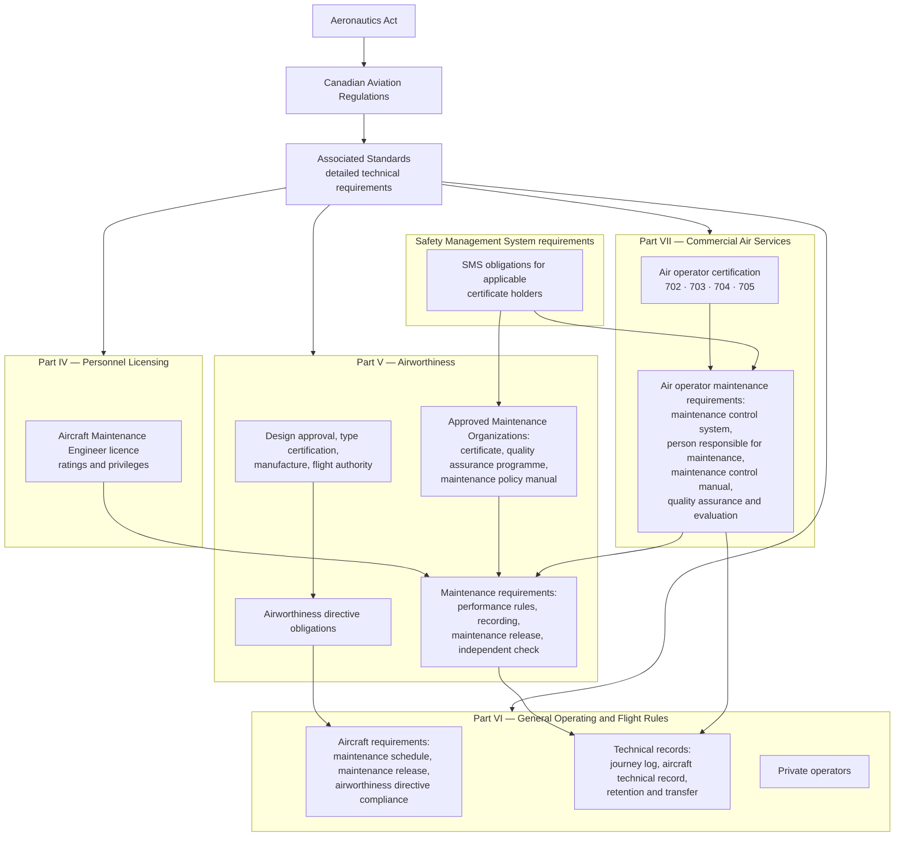
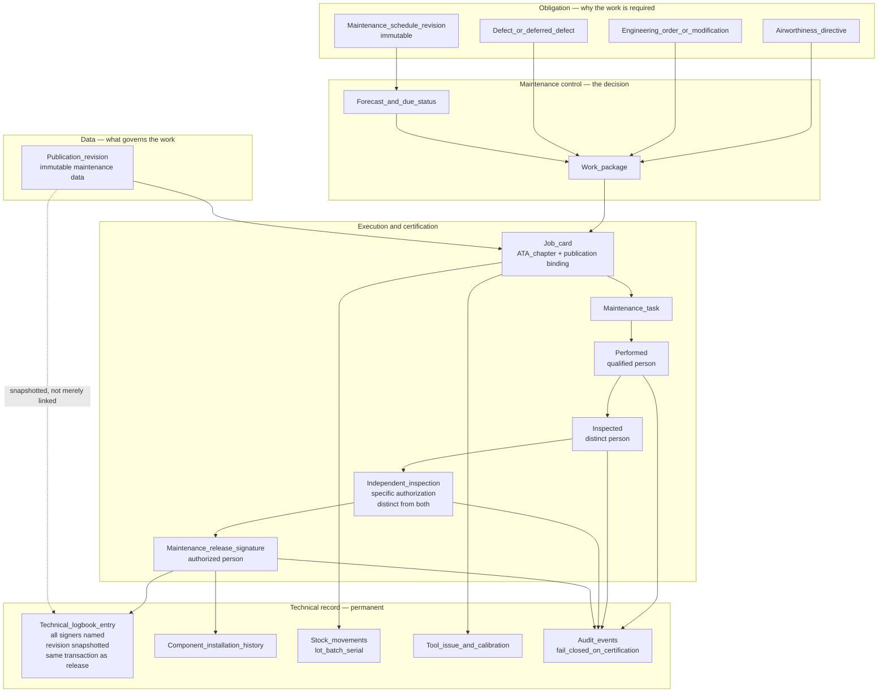

# Transport Canada — Conceptual Mapping of Mercury Capability to Canadian Regulatory Concepts

| Field | Value |
|-------|-------|
| Document | Transport Canada conceptual mapping — CARs orientation, technical records, maintenance release, AMO and operator continuing airworthiness concepts |
| Product | Mercury Aviation Enterprise Operating System (AEOS) |
| Organization | Mercury Technologies |
| Layer | Regulations — descriptive mapping of platform capability to framework concepts |
| Audience | Persons responsible for maintenance, quality assurance managers, AMO accountable executives, operations managers, compliance teams, enterprise architects |
| Status | Living baseline |
| Posture | **Descriptive and advisory. Mercury holds no Transport Canada certificate, approval, acceptance, delegation, or design approval of any kind.** |
| Companion documents | [FAA](FAA.md) · [EASA](EASA.md) · [ICAO](ICAO.md) |
| Upstream authority | [Authority domain](../03_Business/Authority.md) · [SECURITY.md](../../SECURITY.md) · [Blueprint README](../../README.md) |

---

## 1. Scope

### 1.1 In scope

This document maps **Mercury platform capability** to the **concepts** that appear in the Canadian civil aviation maintenance framework: technical records, the maintenance release, the persons who may sign one, independent inspection of specified work, maintenance schedules and airworthiness directive compliance, the maintenance control system of an air operator, the quality assurance programme of an approved maintenance organization, and the evidence a Transport Canada Civil Aviation inspector or an internal auditor asks to see.

| Reader | What they get from this document |
|--------|----------------------------------|
| A **Canadian operator or AMO quality function** | A precise statement of which technical-record and evidence processes Mercury supports, which it supports partially, and which remain entirely within their maintenance control manual or maintenance policy manual |
| A **Mercury architect or consultant** | The vocabulary bridge between CARs concepts — technical records, maintenance release, elementary work, independent check — and Mercury's domain model |

### 1.2 Out of scope

| Concern | Authoritative location |
|---------|------------------------|
| Mercury's regulatory standing and non-claims | [Authority §1.3](../03_Business/Authority.md#13-what-mercury-does-not-claim) · [SECURITY.md §8](../../SECURITY.md#8-what-mercury-does-not-claim) |
| Audit record structure, fail-closed policy, retention behaviour | [Audit](../06_Security/Audit.md) |
| Signature construction, certification chain enforcement, cryptographic limits | [Digital Signatures](../06_Security/Digital_Signatures.md) |
| Traceability edges and the Digital Aircraft Passport | [Digital Thread](../04_Data/Digital_Thread.md) |
| Continuing airworthiness management capability | [CAMO](../03_Business/CAMO.md) |
| Hangar and shop execution capability | [MRO](../03_Business/MRO.md) |
| **Legal interpretation of the CARs or any Standard** | Not provided anywhere in this repository. See §10 |

### 1.3 Honesty markers

| Marker | Meaning |
|--------|---------|
| **Implemented** | Present in the runtime today |
| **Partial** | Present for a subset of the described concept |
| **Planned** | Designed in the blueprint, not built |
| **Not modelled** | Absent, and not currently on a horizon |

There is deliberately **no marker meaning "compliant."** Compliance is a property of an organization's procedures, personnel, and conduct — never of a software feature.

### 1.4 How to read the regulatory references

References in this document are **orientation pointers to the structure of the framework**. The Canadian framework is unusual in one respect that matters here: the *Canadian Aviation Regulations* are supported by a parallel set of **Standards** that carry the detailed technical requirements, and the two must be read together. A reference to a subject area in this document points at both.

| Principle | Consequence |
|-----------|-------------|
| The CARs and the associated Standards govern | Where this document and the current regulation or Standard differ, the regulation is correct and this document is wrong |
| Advisory material is guidance | Transport Canada Civil Aviation advisory circulars and staff instructions describe acceptable means; they are not requirements a platform can hold |
| Mercury does not interpret regulation for customers | Applicability, acceptability, and sufficiency are determined by the organization and its Transport Canada Civil Aviation contact |
| Regulations are amended | A subject-area reference valid at the time of writing may be renumbered or superseded. Verify against the current consolidated text |

---

## 2. Purpose

### 2.1 The question this document answers

Canadian evaluations tend to open with a sharper version of the American question, because the Canadian framework puts the *maintenance release* and the *technical record* at the centre of everything: *"Can our AME sign a maintenance release in Mercury, and will Transport Canada accept it?"*

The answer has two halves, and both must be stated:

1. **An AME signs a maintenance release. Mercury records that act.** Mercury does not issue, authorize, or validate a maintenance release, and no automated Mercury function can produce one.
2. **Whether an organization's electronic technical records and electronic signing are acceptable is a determination for that organization and Transport Canada** — reached through the organization's maintenance control manual or maintenance policy manual, its procedures, and its regulator relationship. Mercury's contribution to that determination is an accurate description of what the platform does and does not do, including the limitations in §7.

What a customer actually needs is therefore narrower and more useful: which technical-record obligations Mercury helps discharge, where Mercury stops, and what the platform can produce when an inspector asks.

### 2.2 The design position underneath the mapping

Mercury's evidence posture, stated in full in [Authority §1.1](../03_Business/Authority.md#11-what-this-domain-exists-to-do): **evidence is a by-product of doing the work correctly, not an artefact assembled afterwards.**

The Canadian framework's emphasis on the technical record makes this position unusually load-bearing. A technical record that is reconstructed at audit time is a narrative; a technical record that was written as the work happened, immutably, attributed to a named person whose authority was verified at that moment, against the immutable revision of the data that governed it, is a record. Mercury produces the second kind, and that is the whole of what makes a mapping document possible.

### 2.3 What "conceptual mapping" means, precisely

| It means | It does not mean |
|----------|------------------|
| A Mercury capability produces data of the kind a regulatory concept concerns | That the data satisfies the requirement |
| The platform enforces a control analogous to one the framework expects | That the enforcement has been reviewed or accepted by Transport Canada |
| An organization can use a Mercury record as part of its technical record set | That the record is, by itself, a compliant technical record |
| Mercury's model uses vocabulary resembling the framework's | That Mercury's use of a term carries the term's regulatory meaning |

---

## 3. What Mercury is not

| Mercury does **not** hold, claim, or imply | The accurate position |
|--------------------------------------------|-----------------------|
| An **Approved Maintenance Organization (AMO) certificate** | AMO certificates are issued to organizations that perform maintenance. Mercury is not an AMO, performs no maintenance, and holds no certificate. A customer's AMO certificate is theirs alone |
| An **Air Operator Certificate** or private operator registration | Held by operators. Mercury holds none and cannot contribute to holding one |
| A **type certificate, supplemental type certificate, or any design approval** | Mercury produces no aeronautical product and no design data requiring approval, and holds no design approval |
| A **Design Approval Organization or Delegate** standing | Mercury holds no delegation and does not act on Transport Canada's behalf for any purpose |
| **Transport Canada "approval" or "acceptance" of the platform, its records, or its electronic signatures** | No Transport Canada office has approved, accepted, reviewed, or evaluated Mercury. Whether an organization's *use* of Mercury is acceptable within its maintenance control manual or maintenance policy manual is a determination for that organization and Transport Canada |
| That using Mercury makes an organization **compliant** with the CARs | Compliance is a property of the organization. Mercury supports it and cannot confer it |
| That Mercury **issues or authorizes a maintenance release** | A maintenance release is signed by a person authorized to do so. Mercury records that act with attribution, authority validity, ordering, and immutable data binding. It never performs the act, and no automated function can. See [Digital Signatures §6.6](../06_Security/Digital_Signatures.md#66-what-release-does-not-do) |
| That Mercury **determines airworthiness** | Determined by qualified persons. Mercury computes, records, and evidences their determinations |
| That Mercury's electronic signature is a **cryptographic** signature | It is a hash-attested attribution mechanism, not a certificate-backed PKI signature. Stated without softening in [Digital Signatures §8](../06_Security/Digital_Signatures.md#8-what-this-is-not--the-cryptographic-limit) |
| That Mercury's technical records are a **tamper-evident** archive | Immutability today rests on code discipline, not on database enforcement or hash chaining. See [Audit §6.4](../06_Security/Audit.md#64-honest-limitation--immutability-is-conventional-not-structural) |
| That Mercury's records satisfy a **journey log** obligation | Mercury does not implement a journey log. See §5.3 |
| That Mercury is a **fully bilingual** product | English and French capability status is stated honestly in §6, and it is Partial |
| That Mercury is approved for **military, defence, or safety-of-life** use | Not claimed. See [ROADMAP §8](../../ROADMAP.md#8-explicit-non-goals) |

**Why this is stated so bluntly.** A Canadian operator or AMO that repeats a vendor's overstatement in a manual submission or during a Transport Canada assessment is exposed in a way the vendor is not. Mercury's position is that the vendor carries the obligation to state its standing precisely. Any Mercury material that softens the table above is wrong and should be corrected against this document.

---

## 4. Regulatory context overview

### 4.1 The structural shape of the framework

The Canadian framework is built from the *Aeronautics Act*, the *Canadian Aviation Regulations* made under it, and the **Standards** that carry the detailed technical content. Its distinctive characteristic for a records platform is that **the technical record and the maintenance release are treated as first-class regulatory objects**, with explicit requirements about what is recorded, who may sign, and how long records are kept.

### 4.2 The subject areas a Mercury deployment most often touches

| CARs area | Subject | Why it appears in Mercury conversations |
|-----------|---------|-----------------------------------------|
| **Part IV — Personnel Licensing and Training** | Aircraft Maintenance Engineer licences, ratings, and the privileges attached to them | The authority behind a maintenance release signature; Mercury's personnel qualification and authorization records concern this |
| **Part V — Airworthiness, maintenance requirements** | Performance rules for maintenance and elementary work, recording of maintenance, the maintenance release and who may sign it, independent inspection of specified work, installation of parts | The heart of the mapping: what is recorded, by whom, under what authority, and against what data |
| **Part V — Approved Maintenance Organizations** | AMO certificate, ratings, quality assurance programme, maintenance policy manual, personnel authorization, records | The MRO and shop case |
| **Part V — Airworthiness directives** | Mandatory continuing airworthiness action and its compliance obligation | Obligation registers, applicability, and compliance evidence |
| **Part VI — Aircraft requirements** | Maintenance schedule, maintenance release before flight, airworthiness directive compliance, weight and balance | The continuing airworthiness obligation carried by the owner or operator |
| **Part VI — Technical records** | Journey log, aircraft technical record, component records, record content, retention, and transfer with the aircraft | The single most relevant area to an electronic records platform |
| **Part VI — Private operators** | Private operator obligations, including maintenance control | The corporate and business aviation case |
| **Part VII — Commercial air services** | Air operator certification for aerial work, air taxi, commuter, and airline operations | Determines which maintenance control obligations apply |
| **Part VII — Air operator maintenance requirements** | Maintenance control system, person responsible for maintenance, maintenance control manual, quality assurance programme, evaluation programme | The operator-side quality loop, structurally analogous to a continuing analysis and surveillance function |
| **SMS requirements** | Safety management system obligations for applicable certificate holders | The SMS-adjacent concepts in §5.7 |

### 4.3 Two Canadian concepts a Mercury architect must get right

| Concept | Why it matters to the platform |
|---------|-------------------------------|
| **Maintenance release** | In the Canadian framework the maintenance release is a **signed statement** by a person authorized to sign it, certifying that the work was performed in accordance with the applicable standards of airworthiness. It is the pivot point of the entire record. Mercury's release certification step and its atomic technical logbook entry exist to make that act evidentiary — **not to constitute it** |
| **Elementary work and servicing** | The framework distinguishes categories of work that do not require a maintenance release signed by an AME from work that does. Mercury does **not** model this distinction as a first-class concept today, which is stated as a gap in §5.2 rather than glossed over. An organization using Mercury must control the distinction through its own procedures and task definitions |

---

## 5. Mercury capability mapping

### 5.1 How to read every table in this section

| Column | Meaning |
|--------|---------|
| **Regulatory concept** | The concept as it appears in the framework, in the framework's vocabulary |
| **Mercury capability** | The platform capability producing data of that kind, with its capability identifier where one exists |
| **Standing** | Implemented, Partial, Planned, or Not modelled — per §1.3 |
| **Remains the organization's responsibility** | What Mercury does **not** do. This column exists so no reader mistakes a populated row for a discharged obligation |

Capability identifiers are drawn from [Authority §2.1](../03_Business/Authority.md#21-capability-register) and [MRO §2.1](../03_Business/MRO.md#21-capability-register).

### 5.2 Maintenance performance, recording, and the maintenance release

| Regulatory concept | Mercury capability | Standing | Remains the organization's responsibility |
|--------------------|--------------------|----------|-------------------------------------------|
| Maintenance performed in accordance with the applicable standards of airworthiness and using the most recent applicable data | Job card bound to a live publication and an immutable revision; release blocked without both plus an ATA chapter (MRO-C10) | Implemented | Obtaining, controlling, and distributing the correct and current data; ensuring the data used is applicable to the aircraft |
| A record of the maintenance performed, describing the work | Job card and maintenance task with description, ATA chapter, and performed-work certification (MRO-C3, MRO-C4) | Implemented | Accuracy and completeness of the description, in the form the organization's manual requires |
| **Maintenance release signed by a person authorized to sign it** | Release certification step requiring an active, unexpired certification authority on the employee record, producing a technical logbook entry atomically (MRO-C5, AUTH-C4) | Implemented | The release act itself; the authorization of the signing person; the wording and content of the release statement under the organization's manual |
| Identification of the person who signed the release, and of the authority under which they signed | Digital signature bound to a named employee, plus the qualification and authorization records with validity dates (AUTH-C3, AUTH-C10) | Implemented | That the person holds the AME licence, rating, or organizational authorization the framework requires. Mercury records the authority data the organization entered; it does not verify a licence with Transport Canada |
| Authority valid at the time of signing, not merely at some point | Expiry evaluated against the signing moment, never against an assignment date | Implemented | Keeping licence, rating, and authorization data current |
| **Independent inspection of specified work**, performed by a person other than the person who did the work | Independent inspection certification step requiring a **specific** independent-inspection authorization, with three enforced distinct-signer separations (MRO-C6, MRO-C7) | Implemented — see [Digital Signatures §5](../06_Security/Digital_Signatures.md#5-double-inspection) | Determining which work requires an independent inspection, authorizing the persons who may perform it, and the procedures governing it |
| Work performed by a person under supervision, with the supervisor's responsibility recorded | Assignment and certification records name the performer; **a supervision relationship is not modelled as a distinct evidence field** | **Partial** | Recording and controlling supervision as the organization's procedures require |
| **Elementary work and servicing** — categories of work not requiring an AME-signed maintenance release | **Not modelled as a first-class distinction.** Task definitions can be structured so that certification steps differ, but the platform does not classify work into these categories or enforce the consequences | **Not modelled** | Classifying work correctly, controlling who may perform each category, and ensuring the correct release path is followed |
| Correction of a record entry | Append-only logbook amendment: the original is preserved and a new record references it (AUTH-C5) | Implemented | The procedure governing corrections, and by whom they may be made |
| Installation of parts, and the acceptability of a part for installation | Component catalogue, serialized components, alternate parts, receiving inspection, and append-only stock movements (AUTH-C9) | Implemented | The acceptability determination, suspected unapproved parts control, and the receiving inspection decision |
| Inspection following an abnormal occurrence — heavy landing, lightning strike, overspeed | Task and work package creation with the occurrence as the originating reference; incident records | **Partial** — the work can be raised and evidenced; **the occurrence-triggered inspection requirement is not automatically derived** | Recognising the occurrence, determining the required inspection, and raising it |

### 5.3 Technical records — the area with the closest fit and the clearest gap

| Regulatory concept | Mercury capability | Standing | Remains the organization's responsibility |
|--------------------|--------------------|----------|-------------------------------------------|
| **Journey log** — a record carried for the aircraft's operational history, with prescribed entries | **Not modelled.** Mercury records maintenance and airworthiness evidence, not the operational journey record | **Not modelled** | The journey log in full, including its content, its carriage where required, and its retention |
| **Aircraft technical record** — the record of maintenance performed, its currency, and its completeness | Technical logbook (append-only), certification event chain, task records, and publication revision binding (AUTH-C4, AUTH-C2, AUTH-C7) | Implemented | Whether the record set, as the organization uses it, satisfies the technical record obligation |
| Records of total air time and cycles of the airframe and of life-limited items | Aircraft utilization counters; component life accumulation with TSN, CSN, TSO, CSO | Implemented — **current counters only; no utilization history table** | Accuracy of reported utilization, and reconciliation against operational sources |
| Current status of life-limited components, with applicable limits | Serialized component life, unit-level limits overriding catalogue defaults, remaining hours, cycles, and calendar due | Implemented — maintained on write, with **no reconciliation job** | Verifying life data on receipt, and reconciling after a records discrepancy |
| Records of component installation, removal, and transfer | Append-only component installation history (AUTH-C8), with one occupant per position guaranteed by constraint | Implemented | Correctness of historical data imported at onboarding |
| Current status of applicable airworthiness directives, with the method and date of compliance | AD register with per-revision compliance position and linked work orders | Implemented — **structured compliance state is Partial**; see [Authority §3.1](../03_Business/Authority.md#31-entity-register) | Applicability determination, method-of-compliance selection, and the compliance decision |
| Records of modifications and repairs, and the data approving them | Engineering order records with approval workflow, linked tasks, and affected components | Implemented — **no dedicated modification record**; modification state is reachable through engineering orders and tasks | The approval of the modification data, and its acceptability |
| Weight and balance record and equipment list currency | Aircraft empty weight and installed configuration | **Partial** — configuration Implemented; **weight and balance computation is Not modelled** | Weight and balance control and its currency |
| **Retention of technical records for the required period** | Durable append-only evidence with configurable retention | **Partial** — retention is enforced as a **query filter**, not a deletion lifecycle. See [Audit §7.2](../06_Security/Audit.md#72-the-retention-window-is-a-query-filter) | Archival, deletion where required, and satisfying the actual retention period. An operator responsibility per [SECURITY.md §10](../../SECURITY.md#10-customer-and-operator-responsibilities) |
| **Transfer of technical records** with the aircraft on sale, lease, or return | Digital Aircraft Passport as a traversal; **one-command evidence pack export is Planned** (AUTH-C14). See [Digital Thread §7.4](../04_Data/Digital_Thread.md#74-implementation-status--stated-plainly) | **Partial** | Executing the transfer, and satisfying the receiving party and Transport Canada that the records are complete |
| Records legible, retrievable, and protected against loss | Scoped retention-aware query, per-object history, task audit trail in one call (AUTH-C6, AUTH-C12) | Implemented for retrieval; **durability guarantee is the operator's backup regime** | Backup, recovery testing, and continuity of access for the retention period |

**The journey log row is deliberately first.** It is the most common source of a false assumption in Canadian evaluations: because Mercury has a "technical logbook," a reader assumes the journey log is covered. It is not. Mercury's technical logbook is a **maintenance release record**, not an operational journey record, and the two are different regulatory objects with different content and carriage expectations.

### 5.4 Air operator maintenance control concepts

| Regulatory concept | Mercury capability | Standing | Remains the organization's responsibility |
|--------------------|--------------------|----------|-------------------------------------------|
| **Maintenance control system** — the operator's system for controlling continuing airworthiness | Maintenance programme with immutable approved revisions, forecast, deferral control, AD register, work package generation, and the full evidence spine | **Partial** — Mercury provides the operating substrate; the maintenance control *system* is the organization's, including its procedures and its accountable persons | Designing, documenting, obtaining approval for, and operating the maintenance control system |
| **Person responsible for maintenance** and defined accountabilities | Personnel records, authorizations, roles, and organization and site membership | Partial — **the accountability structure is recorded, not managed as a regulatory construct** | Appointing the person, defining accountabilities, and notifying Transport Canada as required |
| **Maintenance control manual** — content, revision, and distribution | Publication library with immutable revisions and controlled distribution | Implemented **as a library capability.** Mercury does not author, own, or control the content of an operator's manual | Authoring, revising, obtaining approval or acceptance, and ensuring personnel use the current revision |
| **Maintenance schedule** approved for the aircraft, with intervals and tasks | Maintenance programme, task library, check definitions, intervals, thresholds, and forecast over 30, 90, 180, and 365 days | Implemented | Selecting the schedule, obtaining approval, and operating to the approved version |
| Maintenance schedule revision control, so historical work resolves to the standard in force | Immutable programme revisions; historical work resolves to the revision that governed it | Implemented | Submitting and obtaining approval for revisions |
| **Quality assurance programme** — audits, findings, corrective action, and root cause | Immutable evidence and the full audit trail as the audit data source; **finding and corrective action management (AUTH-C15) and audit programme management (AUTH-C16) are Planned** | **Partial** | The quality assurance programme in full: its scope, its auditors, its independence, its findings, and its corrective action decisions |
| **Evaluation programme** — periodic assessment of the maintenance control system's effectiveness | Execution reporting and reliability trend capability provide the input data | **Partial** | The evaluation programme itself and its conclusions |
| Defect recording, control, and deferral | Deferred defects and MEL items with dispatch category and expiry control; fault codes for structured classification | Implemented | Deferral authority, dispatch decisions, and operational control |
| Defect reporting to Transport Canada where required | Incident records, fault codes, and the audit trail; **structured occurrence capture and export is Planned** (AUTH-C20) | **Partial** | Determining reportability, preparing the report, and submitting it within the required period |
| Contracted maintenance and its oversight | Vendor records, purchase orders, receiving inspection, and material traceability; **no cross-organization work transfer construct** | **Partial** | Contracting, the AMO's approval status, and the operator's oversight programme |
| Personnel training and qualification for maintenance control functions | Personnel qualification records with type, reference, and validity | **Partial** — records Implemented; **training programme delivery and curriculum tracking are Not modelled** | The training programme, its content, its delivery, and its records |

### 5.5 Approved Maintenance Organization concepts

| Regulatory concept | Mercury capability | Standing | Remains the organization's responsibility |
|--------------------|--------------------|----------|-------------------------------------------|
| AMO certificate, ratings, and the scope of work performed under them | Organization and site model; task and capability data can be structured to reflect scope | **Partial** — **rating scope is not enforced as a control.** Mercury will not refuse work because it falls outside a rating | Holding the certificate, working within the rating scope, and controlling scope procedurally |
| **Maintenance policy manual** — content, revision, and distribution | Publication library with immutable revisions | Implemented as a library capability | Authoring, revising, and obtaining approval or acceptance of the manual |
| **Quality assurance programme** independent of production, with audits and corrective action | Audit trail and immutable evidence as the data source; **finding and corrective action management and audit programme management are Planned** | **Partial** | The programme, the independence of its auditors, and its operation |
| Persons authorized to sign a maintenance release, and the record of that authorization | Personnel authorization records with validity dates; permission-gated release capability enforced in the domain layer | Implemented | Granting authorizations, maintaining the record in the form the framework requires, and withdrawing them when appropriate |
| Technical data available to personnel at the point of use, and current | Publication library; release blocked without a live publication and matching immutable revision | Implemented | Obtaining current, acceptable data and controlling its distribution |
| Tools and equipment adequacy, including calibration | Tool crib control with reservation, issue, return, calibration currency, and lost-tool reporting (MRO-C15) | Implemented | Tool adequacy, the calibration programme, and its traceability to a standard |
| Parts and material control, including receiving inspection and traceability | Append-only stock movement ledger (AUTH-C9), receipts with receiving inspection, vendor records, lot and serial identity, FIFO and FEFO issue (MRO-C14) | Implemented | Acceptance criteria, suspected unapproved parts control, and the receiving decision |
| Segregation and control of unserviceable components | Stock states and the movement ledger | **Partial** — states Implemented; **a dedicated quarantine workflow is Not modelled** | Physical segregation and its control |
| Records of work performed, retained and made available to Transport Canada | Task audit trail endpoint returning the full certification and audit history in one call (AUTH-C6) | Implemented | Making records available, and the retention obligation |
| Shop work on components, with life continuity across the shop visit | Rotable cycle open and close, component history, and life data (MRO-C16) | **Partial** — **a full shop-visit lifecycle with life continuity is a named gap**; see [Digital Thread §7.3](../04_Data/Digital_Thread.md#73-who-consumes-the-passport-and-for-what) | Shop procedures, capability, and the release of the component |
| Reporting of service difficulties and defects | Fault codes and incidents; structured occurrence capture **Planned** | **Partial** | Reportability determination and submission |

### 5.6 Airworthiness directive and mandatory action concepts

| Regulatory concept | Mercury capability | Standing | Remains the organization's responsibility |
|--------------------|--------------------|----------|-------------------------------------------|
| Airworthiness directive applicability to a specific aircraft or component | AD register with applicability data and effectivity references | **Partial** — the register and its data are Implemented; **automated applicability evaluation against effective configuration is Partial** | The applicability determination |
| Compliance within the required time, by the required method | Task and work package generation linked to the AD record, with forecast and due tracking | Implemented | Selecting the method of compliance and making the compliance decision |
| Recording of compliance, including method, date, and the person certifying | AD compliance record linked to work orders, whose releases carry the full certification chain and logbook entries | Implemented — **structured compliance state is Partial** | Sufficiency of the compliance record under the organization's manual |
| Recurring inspections arising from a directive | Programme task with interval and threshold, forecast, and due status | Implemented | Establishing the recurring requirement correctly |
| Alternative means of compliance | Engineering order record with approval workflow and linked tasks | **Partial** — the record and approval exist; **there is no distinct alternative-means construct** | Obtaining approval for the alternative means |
| Foreign directive adoption where an aircraft's design originates elsewhere | AD register accepts directives from any issuing source | Implemented as a data capability | Determining which directives apply and under which authority's adoption |

### 5.7 SMS-adjacent concepts

Mercury is **not** a safety management system. It is a source of maintenance safety data and an audit-evidence spine.

| SMS-adjacent concept | Mercury capability | Standing | Remains the organization's responsibility |
|----------------------|--------------------|----------|-------------------------------------------|
| Accountable executive and defined safety accountabilities | Organization, site, role, and membership model; accountable persons recorded as personnel | **Partial** — structure recorded; **the SMS framework is Not modelled** | The SMS, its policy, and its accountabilities |
| Hazard identification from maintenance and operational data | Fault codes, incident records, deferred defect history, reliability trend capability, and the complete audit trail | **Partial** — the data exists; hazard identification is not a platform function | Hazard identification, analysis, and risk assessment |
| Risk assessment and mitigation records | Approval workflow and engineering order records can carry documented decisions | Partial | Methodology, decisions, and their acceptability |
| Safety assurance — internal audit, measurement, management of change | Execution reporting, immutable evidence; **audit programme and finding management are Planned** | **Partial** | The safety assurance function |
| Internal reporting scheme, including non-punitive and confidential reporting | **Not modelled.** Occurrence capture is **Planned** (AUTH-C20); a confidential channel is a distinct requirement Mercury does not address | Not modelled | The reporting scheme, its confidentiality protections, and its just-culture framework |
| Safety data retention and protection | Append-only audit and evidence records with configurable retention and permission-gated access | Partial | Safety data content, retention, protection, and lawful use |
| Training, communication, and safety promotion | Personnel qualification records | Partial | Training, communication, and promotion in full |

---

## 6. Bilingual and Canadian records considerations

Canada's official-languages context affects a records platform in ways that a purely functional mapping would miss. These are stated honestly rather than aspirationally.

| Consideration | Mercury position | Standing |
|---------------|------------------|----------|
| **User interface in English and French** | The interface is currently English. The architecture does not preclude localization, and no design decision blocks it, but **a French interface does not exist today** | **Not modelled** |
| **Record content in either official language** | Free-text fields — work descriptions, signer notes, amendment reasons, audit detail — accept any Unicode content, so a technician may record in French, in English, or in both | Implemented as a data capability |
| **Terminology and reference data in both languages** | Master data such as ATA chapter titles, statuses, and fault codes is single-language today. Bilingual reference data would require a translation layer on master data | **Not modelled** |
| **Bilingual output and export** | No export produces parallel-language output. When evidence pack export is delivered, bilingual presentation is a design consideration, not a current capability | **Planned consideration** |
| **Mixed-language records within one aircraft's history** | Supported by construction, because content is stored as entered and never normalized. This is a genuine advantage of the append-only model: a French entry from 2019 is preserved exactly as written | Implemented |
| **Search and retrieval across mixed-language content** | Text search is language-naive; accent- and diacritic-insensitive matching is not implemented | **Partial** |
| **Data residency in Canada** | A deployment-time decision. Mercury's architecture supports deployment in a chosen region; **Mercury does not itself operate a Canadian region as a product commitment** | Operator responsibility |
| **Personal information handling** | Personnel records, signer identities, and qualification data are personal information. Access is permission-gated, organization-scoped, and audited; field-level encryption is **Planned** | **Partial** |
| **Provincial and federal privacy obligations** | The organization determines its obligations and its lawful basis for processing. Mercury provides access control, audit, and minimization; it does not determine compliance | Operator responsibility |

**Why this section exists at all.** A Canadian operator evaluating an enterprise platform will ask about French-language capability, and the answer today is that record *content* is language-agnostic while the *interface and reference data* are not. Saying that plainly is more useful than a roadmap promise, and it lets the operator judge whether the gap matters for their organization.

---

## 7. Evidence flow, security, and records considerations

### 7.1 From maintenance schedule to signed maintenance release

### 7.2 The record properties Canadian technical-record concepts depend on

| Property the framework cares about | Mercury position | Standing |
|------------------------------------|------------------|----------|
| **Attribution to one identified person** | A signature names an employee, requires that employee to be bound to the authenticated user, and requires a step-up credential at the moment of signing | Implemented — with the administrator override named as debt in [Digital Signatures §8.5](../06_Security/Digital_Signatures.md#85-additional-named-limitations) |
| **Authority current at the time of the act** | Expiry evaluated against the signing moment | Implemented |
| **Intent to sign** | A step-up credential is required; a live session is insufficient | Implemented |
| **The record states what data authorized the work** | Immutable revision binding enforced at release, with revision number, date, and effective date snapshotted into the logbook entry | Implemented — see [Digital Signatures §7](../06_Security/Digital_Signatures.md#7-publication-revision-binding) |
| **Independence of an independent inspection, provable from the record** | Every signer is a separate identity field on the logbook entry, so independence is provable from one record without replaying events | Implemented |
| **Protection against unauthorized alteration** | No code path updates or deletes a signature, certification event, logbook entry, component history record, or stock movement | **Partial — conventional, not structural.** Database-enforced append-only and hash chaining are **Planned** |
| **Detection of alteration** | **Not achieved today.** A per-record digest does not defeat a privileged actor who can recompute it | **Planned** |
| **Retrievability and legibility for the retention period** | Scoped retention-aware query, per-object history, one-call task audit trail | Implemented; **evidence pack export is Planned** |
| **Retention for the required period** | Retention configuration filters reads; records are not deleted | **Partial** — a read filter, not a lifecycle |
| **Protection against loss** | Durable relational storage subject to the operator's backup regime; RPO 0 for evidence is the aspirational target | **Partial** — the current guarantee is the operator's |
| **Access appropriate to sensitivity, with denials recorded** | Permission-gated, organization- and site-scoped access; denials audited | Implemented — runtime persona RBAC hardening **Planned** |
| **A record of who read sensitive records** | Mutating actions audited; **sensitive-read auditing is Planned** | **Planned** |

### 7.3 The three limitations a customer must carry into a Transport Canada conversation

1. **Signatures are hash-attested, not certificate-backed.** There is no private key under the signer's sole control, no certificate chain, no revocation checking, and no trusted timestamp. PKI and smart-card methods are **refused rather than simulated** — see [Digital Signatures §8.3](../06_Security/Digital_Signatures.md#83-pki-methods-are-refused-not-simulated) — so that no record overstates its own strength.
2. **Immutability is enforced by code discipline, not by the database.** Records resist tampering through the application. They do not prove to a third party that no one with database credentials altered them.
3. **Retention hides rather than deletes.** The configured window filters queries. An organization with a deletion obligation must implement archival and deletion at the data tier.

An operator's maintenance control manual or an AMO's maintenance policy manual describing Mercury should describe these three accurately. An overstatement here is the kind that surfaces during an assessment.

---

## 8. Scalability of evidence

### 8.1 Why this belongs in a regulatory mapping

A technical record that exists but cannot be retrieved within the time an assessment allows is functionally absent. Canadian record obligations extend across the life of the aircraft and beyond its withdrawal from service, which makes long-horizon retrievability a regulatory property rather than an engineering nicety.

### 8.2 What grows

| Evidence class | Growth driver | Characteristic |
|----------------|---------------|----------------|
| Certification events and signatures | Maintenance activity | Steady; one short transaction per act, independent of platform size |
| Technical logbook entries | Maintenance releases | One per release; the densest and most-queried record |
| Component installation history | Installs, removals, transfers, releases | Append-only, and the basis of point-in-time configuration answers |
| Stock movements | Material activity | Among the fastest-growing tables |
| Audit events | Every mutating action | The fastest-growing table, and the one an investigation traverses |
| Publication and programme revisions | Data and schedule updates | Slow growth, very high fan-in — every release resolves to one |

### 8.3 Levers, in dependency order

| # | Lever | What it unlocks for technical records at scale |
|---|-------|-----------------------------------------------|
| 1 | Time partitioning of audit and evidence tables | Bounded query cost over decades of history; archival by detaching a partition |
| 2 | Database-enforced append-only | Immutability becomes structural; partition management simplifies because nothing is updated |
| 3 | Tamper-evident hash chaining with external anchoring | Alteration of an interior record becomes detectable by a third party |
| 4 | Object storage with integrity verification | Certificates, photographs, and document content become durable and integrity-checked rather than referenced |
| 5 | Evidence pack export with resolvable references | Record transfer on sale, lease, or return becomes a command instead of a project |
| 6 | Aircraft passport read model | Lessor, buyer, and oversight views served from a projection rather than a multi-domain traversal |
| 7 | Read replicas for evidence reads | Assessment and reporting load off the operational primary |
| 8 | Tiered storage with an immutable archive | Long-horizon retention at sustainable cost, and the basis of a real retention lifecycle |

Item 3 assumes a total record order, which interacts with item 1's partitioning. Deciding the sequencing model before implementing either is the difference between a clean design and a migration — stated identically in [Audit §11.2](../06_Security/Audit.md#112-scaling-levers-in-dependency-order).

### 8.4 What must survive any scaling change

- Fail-closed audit on certification acts; asynchrony must never enter a fail-closed write.
- Atomicity of maintenance release, technical logbook entry, and component history.
- The three enforced distinct-signer separations, and the row locking that makes them correct under concurrency.
- Immutable publication revision binding, with revision detail snapshotted into the logbook entry.
- Organization and site scoping on every read.
- Provenance honesty, including the `simulated` marker that prevents demonstration data from ever reading as an airworthiness fact.

---

## 9. Future enhancements

| # | Enhancement | Value in a Canadian framework context | Depends on |
|---|-------------|---------------------------------------|------------|
| 1 | **Evidence pack export** with resolvable revision references (AUTH-C14) | Technical record transfer on sale, lease, or return becomes a single command; an assessment request becomes a bundle | Publication revision resolution, already present. [ROADMAP §4](../../ROADMAP.md#4-near-term-horizon--assurance-and-hardening-additive) |
| 2 | **PKI and smart-card signature providers** | Moves maintenance release attribution from hash attestation toward certificate-backed non-repudiation — the substance of an electronic-signature discussion in a manual submission | Key management, certificate lifecycle, revocation, timestamp authority |
| 3 | **Tamper-evident chaining with external anchoring** | Changes the claim from "we do not alter technical records" to "alteration is detectable" | Database-enforced append-only, plus a sequencing decision |
| 4 | **Database-enforced append-only** | Immutability becomes structural rather than conventional | Migration plus a database permission model |
| 5 | **Retention as a true lifecycle** — hot, warm, immutable archive, deletion | Addresses long-horizon retention that a read filter cannot | Partitioning and archive tiering |
| 6 | **Finding and corrective action management** (AUTH-C15) | Gives the quality assurance and evaluation programmes a home inside the evidence spine instead of alongside it | Quality domain expansion |
| 7 | **Audit programme management** (AUTH-C16) | Scheduled internal audit with evidence, closing the quality assurance loop | Quality domain expansion |
| 8 | **Structured occurrence capture and export** (AUTH-C20) | Supports service difficulty and defect reporting with structured data instead of free text | Quality domain expansion |
| 9 | **Elementary work and servicing classification** | Would let the platform model the Canadian distinction explicitly and enforce the correct release path per category, closing the gap in §5.2 | An ADR, plus task and personnel model extension |
| 10 | **French-language interface and bilingual reference data** | Removes the most concrete Canadian adoption obstacle named in §6 | A localization layer plus master data translation |
| 11 | **Read-scoped, time-boxed oversight access** (AUTH-C17) | Lets an organization show technical records to an inspector or auditor without granting tenancy or operational capability | Cross-organization sharing construct |
| 12 | **Authority portal — described, not committed** | A future scoped, read-only, audited surface for an oversight reviewer. Design constraints are recorded in [FAA §9.1](FAA.md#91-the-authority-portal-concept--stated-carefully) and apply identically here | Item 11, plus items 1, 3, and 5 |
| 13 | **Point-in-time authority projection** | Answers "what licence, rating, and authorization did this person hold on that date" without reconstruction — the question asked about a signature from years ago | Personnel and audit projections |
| 14 | **Structured regulatory requirement mapping** (AUTH-C19) | Turns this document from prose into queryable links between a framework concept and the evidence records supporting it | Evidence pack export, plus a requirement register |
| 15 | **Shop-visit lifecycle with component life continuity** | Closes the component and engine shop gap named in §5.5 | Component and logistics domain extension |

**A standing constraint on this list.** No item above will be described as delivering Transport Canada approval, acceptance, or compliance. Each delivers *evidence capability*. The distinction is the difference between an accurate statement and a misrepresentation to a regulated buyer.

---

## 10. Disclaimers

1. **No Transport Canada approval, acceptance, certification, or delegation.** Mercury Technologies holds none of these, has not applied for any, and does not claim any. No Transport Canada office has reviewed, evaluated, or accepted the Mercury platform.
2. **This document is not legal or regulatory advice.** It is an engineering and product mapping document. It does not interpret the *Canadian Aviation Regulations* or any Standard, determine applicability, or establish that any Mercury capability satisfies any requirement.
3. **References are orientation, not authority.** Subject-area references are given so a reader can locate a concept. The current consolidated text of the CARs and the associated Standards governs. Where this document and that text differ, this document is wrong.
4. **Compliance is the organization's, always.** Whether an organization's use of Mercury satisfies its technical record, maintenance release, quality assurance, or reporting obligations is a determination for that organization and Transport Canada.
5. **Capability markers describe software, not compliance.** "Implemented" means the capability exists in the runtime. It never means a regulatory requirement is met.
6. **Named gaps are real.** No journey log; elementary work and servicing not modelled as a first-class distinction; weight and balance computation absent; AMO rating scope not enforced; retention is a read filter rather than a lifecycle; signatures are not certificate-backed; immutability is conventional rather than structural; the interface is not bilingual. These must not be omitted when Mercury capability is described to an operator, an AMO, or Transport Canada.
7. **No representation about a third party's determination.** Nothing here predicts how any Transport Canada inspector or assessment will treat an organization's processes, records, or use of Mercury.
8. **Mercury does not interact with Transport Canada.** There is no interface, data exchange, notification, or reporting channel between the platform and any Transport Canada system. Every regulatory interaction is the organization's.
9. **Data residency and privacy are deployment matters.** Mercury's architecture supports regional deployment; Mercury makes no product commitment about where a given customer's data resides, and the organization determines its own privacy obligations.
10. **This document is a living baseline.** It will change as capability changes and as the framework changes. A dated copy extracted from this repository may be stale; the repository is the source of truth.

---

## 11. Related documents

**Within the regulations set**
[FAA](FAA.md) · [EASA](EASA.md) · [ICAO](ICAO.md)

**Business domains**
[Authority](../03_Business/Authority.md) · [CAMO](../03_Business/CAMO.md) · [MRO](../03_Business/MRO.md) · [Airline](../03_Business/Airline.md) · [OEM](../03_Business/OEM.md) · [Leasing](../03_Business/Leasing.md)

**Security and evidence**
[Audit](../06_Security/Audit.md) · [Digital Signatures](../06_Security/Digital_Signatures.md) · [RBAC](../06_Security/RBAC.md) · [Identity](../06_Security/Identity.md) · [SECURITY.md](../../SECURITY.md)

**Data and digital thread**
[Digital Thread](../04_Data/Digital_Thread.md) · [Data Model](../04_Data/Data_Model.md) · [Master Data](../04_Data/Master_Data.md)

**Architecture**
[Domain Architecture](../02_Architecture/Domain_Architecture.md) · [Enterprise Architecture](../02_Architecture/Enterprise_Architecture.md) · [System Context](../02_Architecture/System_Context.md) · [Technical Architecture](../02_Architecture/Technical_Architecture.md)

**Repository root**
[README](../../README.md) · [VISION](../../VISION.md) · [ROADMAP](../../ROADMAP.md)

---

*Mercury Technologies — One Digital Thread. One Digital Aircraft Passport. One Aviation Enterprise Operating System.*
