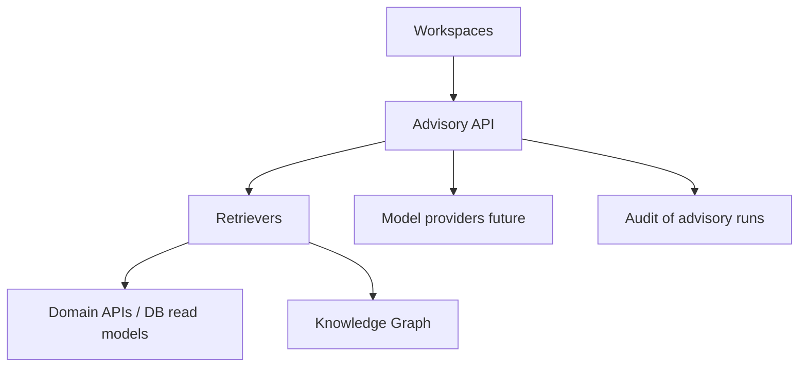

# AI Platform Architecture

## 1. Purpose

Architecture of Mercury AI as an **advisory platform** grounded in Digital Thread evidence ([ADR-0008](../08_Standards/ADR/ADR-0008-ai-advisory-only.md)).

## 2. Design principles

- Human-in-the-loop for any operational decision.
- Citations required for recommendations.
- No write path to certification signatures.
- Deterministic stubs allowed if labelled.
- Knowledge graph projections are derived, not authoritative over OLTP.

## 3. Architecture

## 4. NFRs / Security / Scalability

- PII minimization in prompts; org-scoped retrieval; rate limits; cost controls; eval harness in Test Strategy.

## 5. Related

[AI Strategy](../07_AI/AI_Strategy.md) · [Mercury AI](../05_Product/products/Mercury_AI.md) · [Knowledge Graph](../07_AI/Knowledge_Graph.md)
