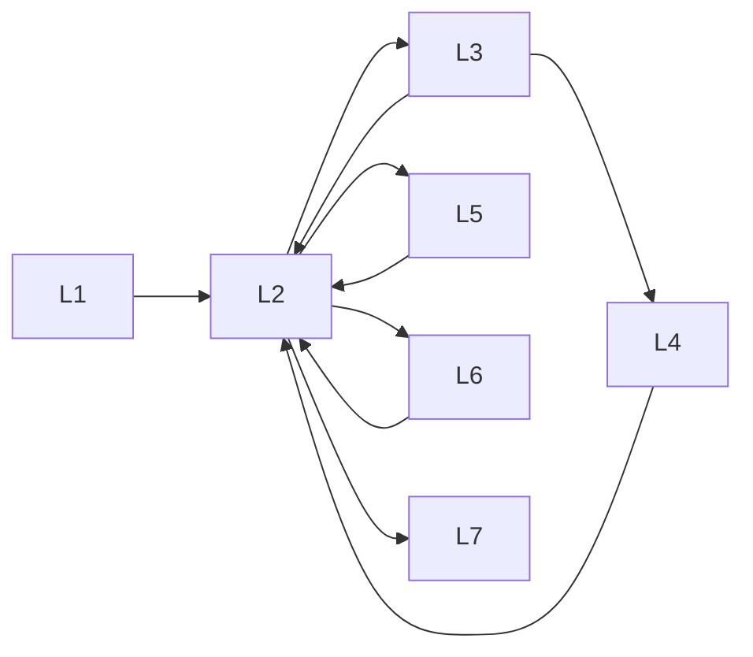

# Aircraft Lifecycle Model

## 1. Purpose

Canonical lifecycle stages for the Digital Thread and Passport — from manufacture to retirement.

## 2. Stages

| Stage | Name | Typical owners | Thread emphasis |
|-------|------|----------------|-----------------|
| L1 | Birth / induction | OEM, operator | Identity, baseline config |
| L2 | Operate | Airline / BA / cargo / heli | Utilization, defects |
| L3 | Maintain | MRO / operator mx | Tasks, WO, logistics |
| L4 | Modify | Engineering / OEM | Config change, pubs |
| L5 | Lease / transfer prep | Lessor, operator | Passport pack |
| L6 | Store / park | Operator | Preservation tasks |
| L7 | Retire / part-out | Owner | Final evidence, tear-down |

## 3. Security / APIs

Lifecycle does not weaken org isolation. Passport export APIs (Planned) snapshot stage evidence.

## 4. Related

[Digital Thread](../04_Data/Digital_Thread.md) · [Digital Airworthiness Passport](Digital_Airworthiness_Passport.md)
