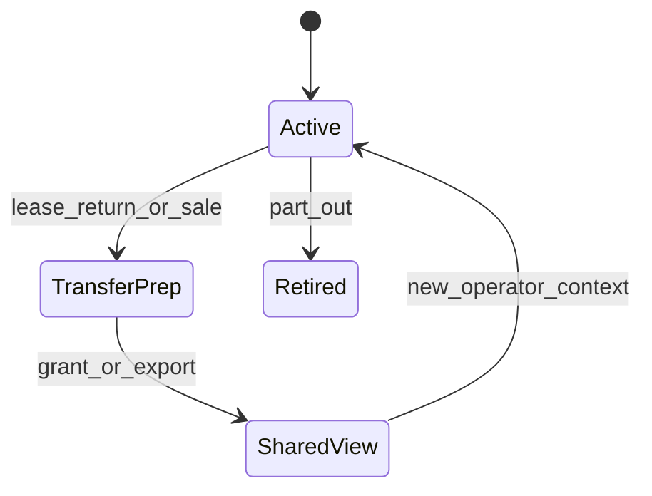

# Digital Airworthiness Passport — Architecture

| Field | Value |
|-------|--------|
| Status | Normative architecture; productization Partial |
| Product sheet | [Mercury_Digital_Airworthiness_Passport.md](../05_Product/products/Mercury_Digital_Airworthiness_Passport.md) |
| Thread essay | [Digital_Thread.md](../04_Data/Digital_Thread.md) |

## 1. Purpose

Define the **Digital Airworthiness Passport** as the productized, transferable projection of an aircraft's identity, configuration, life data, and airworthiness evidence assembled from the Digital Thread.

The Passport is **not** a second database. It is a governed view and export surface over thread-complete records.

## 2. Design principles

1. Resolvability over narrative — every claim links to records.
2. Organization isolation preserved during sharing via explicit grants (future).
3. Append-only evidence; amendments are new records.
4. Suitable for lease return, sale, and audit presentation.
5. No claim that Mercury replaces authority airworthiness review.

## 3. Passport contents

| Section | Sources |
|---------|---------|
| Identity | Aircraft, registrations, model, manufacturer |
| Configuration | Serialized components, install/remove history, positions |
| Life | TSN/TSO/CSN/CSO, utilization |
| Maintenance evidence | Tasks, job cards, signatures, II/ACA |
| Publications | Revisions in force at certification |
| Deferred | Defects / MEL with expiry |
| Material provenance | Issues/repairs linked when present |
| Audit | Provenance of critical actions |

## 4. Lifecycle

## 5. APIs / Security / NFRs

- Future `/api/v1/passport/{aircraft_id}` and export jobs.
- Today: compose via fleet/components/maintenance/work-order/logistics APIs.
- Security: read scoped to org; cross-org requires audited grant (Planned).
- Scalability: async export for large histories; pagination of evidence lists.

## 6. Roadmap

Productized UX, sealed export packages, lessor packs, optional cryptographic anchoring (see Digital Signatures limits).

## 7. Related

[ADR-0002](../08_Standards/ADR/ADR-0002-digital-thread-passport.md) · [Aircraft Lifecycle](Aircraft_Lifecycle_Model.md) · [Leasing](../03_Business/Leasing.md)
