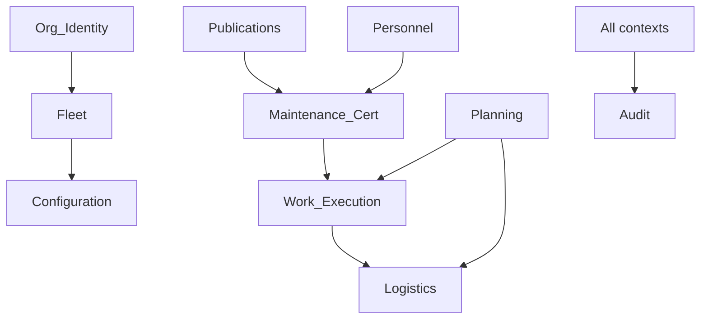

# Domain-Driven Design — Mercury AEOS

| Field | Value |
|-------|--------|
| Scope | Bounded contexts, ubiquitous language, aggregates, context mapping |
| Status | Normative |
| Stack mapping | FastAPI domain packages |

## 1. Purpose

Apply DDD so AEOS modules remain coherent as the product line grows — without premature microservices ([ADR-0004](../08_Standards/ADR/ADR-0004-api-first-modular-monolith.md)).

## 2. Design principles

| Principle | Practice |
|-----------|----------|
| Ubiquitous language | Controlled terms in CONTRIBUTING; aircraft ≠ registration ≠ passport view |
| Bounded context | One Python package per context where practical |
| Aggregate consistency | Certification and stock ledgers commit atomically inside a context |
| Anti-corruption | External OCC/ERP/PLM adapted in Connect — not leaked into Core models |
| Shared kernel | Org id, audit, RBAC, ATA, manufacturer references |

## 3. Bounded contexts

| Context | Package (runtime) | Core aggregates |
|---------|-------------------|-----------------|
| Identity & Org | `org`, security | Organization, Membership |
| Fleet | `fleet` | Aircraft, Fleet |
| Configuration | `components` | Catalog, SerializedComponent, InstallHistory |
| Publications | `publications` | Publication, Revision |
| Personnel | `personnel` | Employee, Authorization |
| Maintenance/Cert | `maintenance` | Task, Signature, Logbook |
| Work Execution | `work_orders` | WorkPackage, WorkOrder, JobCard |
| Planning | `planning` | Program, Check, AD/SB/EO |
| Logistics | `logistics` | PartMaster, StockMovement, PO, Tool |
| Audit | `audit` | AuditEvent |

## 4. Context map

## 5. Security / NFRs / Scalability

- Each context enforces org isolation in services.
- Cross-context calls prefer service APIs in-process today; events later.
- Extraction of a context to a service requires ADR.

## 6. Related

[Domain Architecture](../02_Architecture/Domain_Architecture.md) · [Coding Standards](../08_Standards/Coding_Standards.md)
