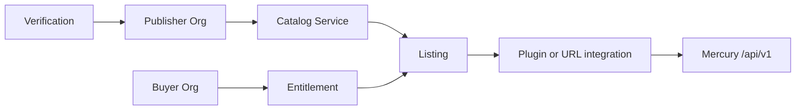

# Marketplace Architecture

| Status | **Planned** runtime; architecture normative |

## 1. Purpose

Architecture for Mercury Marketplace: verified listings (apps, training, services, selective material) on AEOS tenancy and Digital Thread honesty rules.

## 2. Design principles

- Listings never bypass org isolation.
- Publishers are Organizations with verification state.
- Apps call public APIs / plugins — no direct DB.
- Commercial claims must match blueprint honesty (Delivered/Partial/Planned).
- Supplier verification required before parts-class listings.

## 3. Components

## 4. Security / NFRs

Zero Trust access to publish APIs; signed artifacts (future); audit of publish/entitle; rate limits; data residency as per deployment.

## 5. Roadmap

Academy/Connect app listings first; parts later; settlement last.

## 6. Related

[Marketplace Standards](../08_Standards/Marketplace_Standards.md) · [Plugin Architecture](Plugin_Architecture.md) · [Mercury Marketplace](../05_Product/products/Mercury_Marketplace.md)
