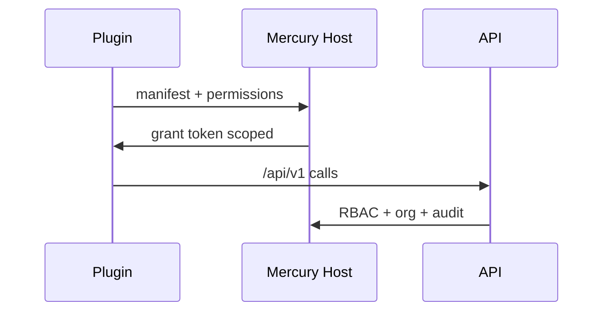

# Plugin Architecture

| Status | **Planned** (OpenAPI foundation Delivered) |

## 1. Purpose

Safe extensibility for Connect and Developer Platform: plugins extend UX/workflows via contracts, not database coupling.

## 2. Design principles

- Capability manifests declare required permissions.
- Plugins call /api/v1 only.
- Sandbox orgs for testing.
- Signed artifacts before Marketplace publish.
- Cannot register certification handlers that skip SoD.

## 3. Model

## 4. Related

[Developer Platform](../05_Product/products/Mercury_Developer_Platform.md) · [Marketplace Architecture](Marketplace_Architecture.md) · [API Standards](../08_Standards/API_Standards.md)
