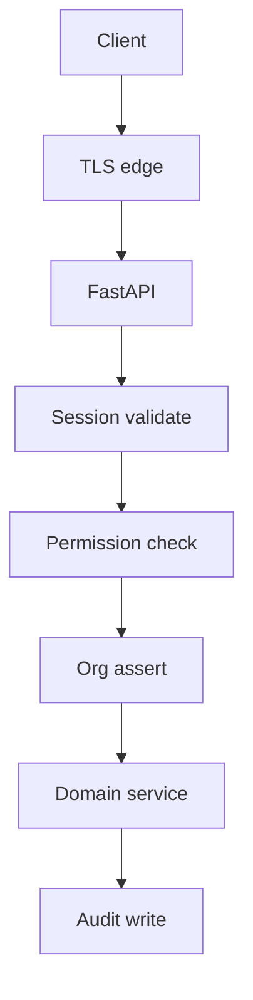

# Zero Trust Architecture

## 1. Purpose

Define Zero Trust for Mercury AEOS: **never trust network location**; authenticate and authorize every request; assume breach; audit continuously.

## 2. Design principles

| Pillar | Mercury control |
|--------|-----------------|
| Verify explicitly | Session auth; future OIDC/MFA |
| Least privilege | RBAC + personas + org membership |
| Assume breach | Org isolation; fail-closed audit; soft delete |
| Continuous monitoring | Audit streams; connector health; metrics |
| Encrypt | TLS in transit; at-rest via platform hosting controls |

## 3. Architecture

## 4. NFRs / Scalability / Future

- AuthN latency budgets; session store HA (Redis Planned).
- Device posture and step-up MFA Planned.
- No implicit trust for Marketplace plugins.

## 5. Related

[Identity](../06_Security/Identity.md) · [RBAC](../06_Security/RBAC.md) · [Audit](../06_Security/Audit.md) · [SECURITY.md](../../SECURITY.md)
